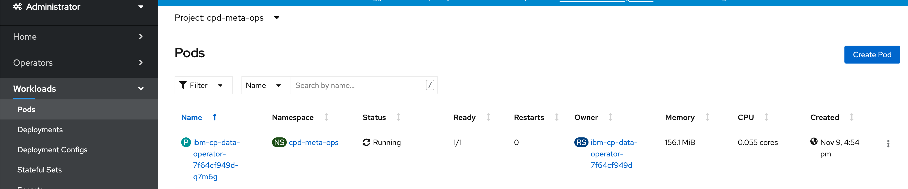
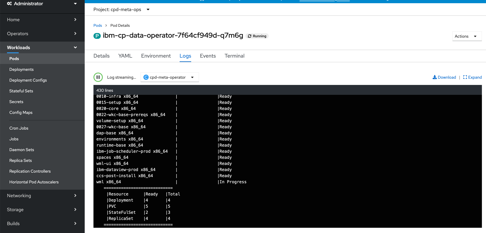
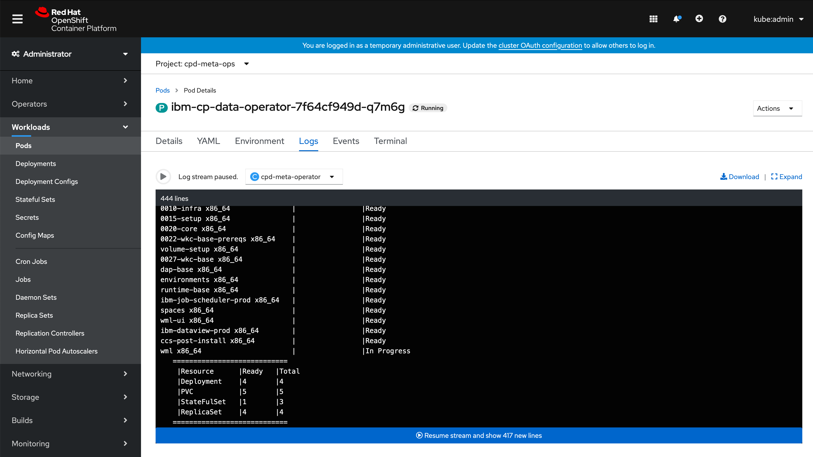

### Checking the cp4d service installation status
* To check the cp4d service isntallation status follow these steps:
  1. Click on the openshift console url and login with the `openshift-username` and `openshift-password` that you provided in the `variables.tf` file.
  2. From top of the ocp console window change the current project to `cpd-meta-ops`:
  
  3. On the left hand side of the ocp console window go to Workloads --> Pods:
  
  4. Click on the Operator pod which will be in the format `ibm-cp-data-operator-*` and select the `Logs` tab, here you can see the current cp4d services installation logs:
   
  
