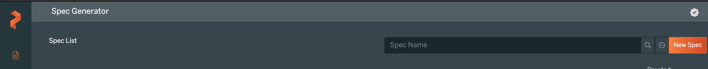
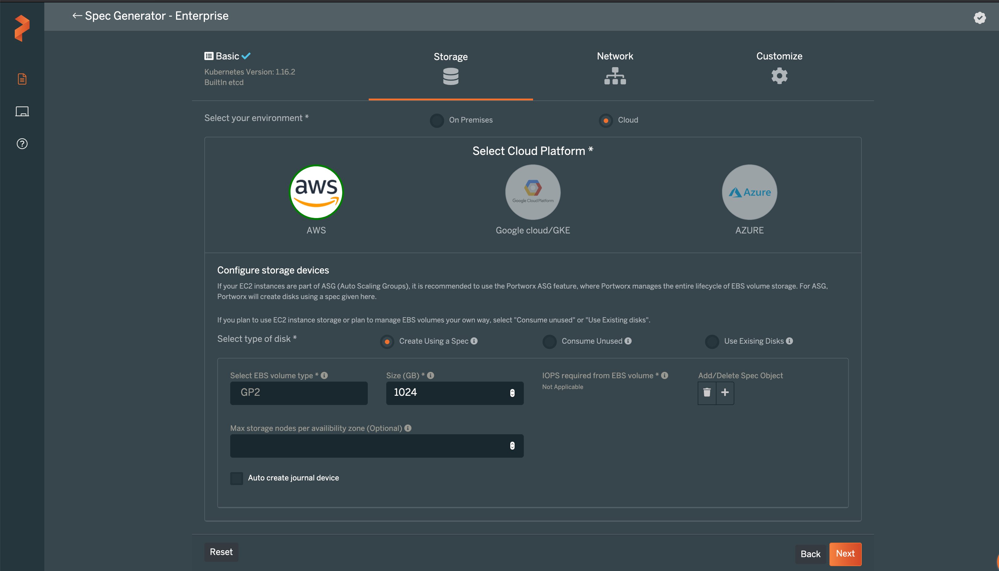
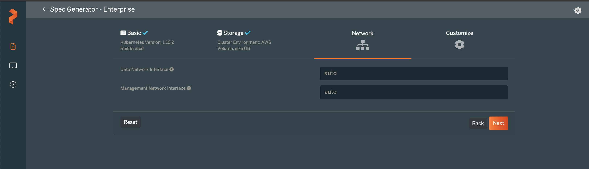
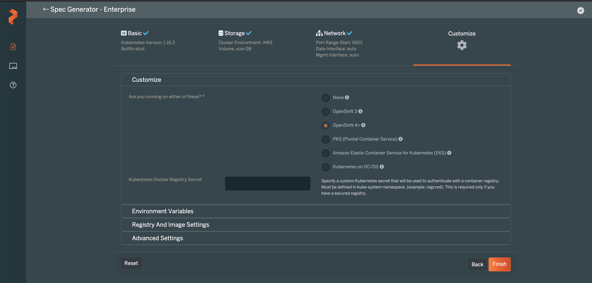
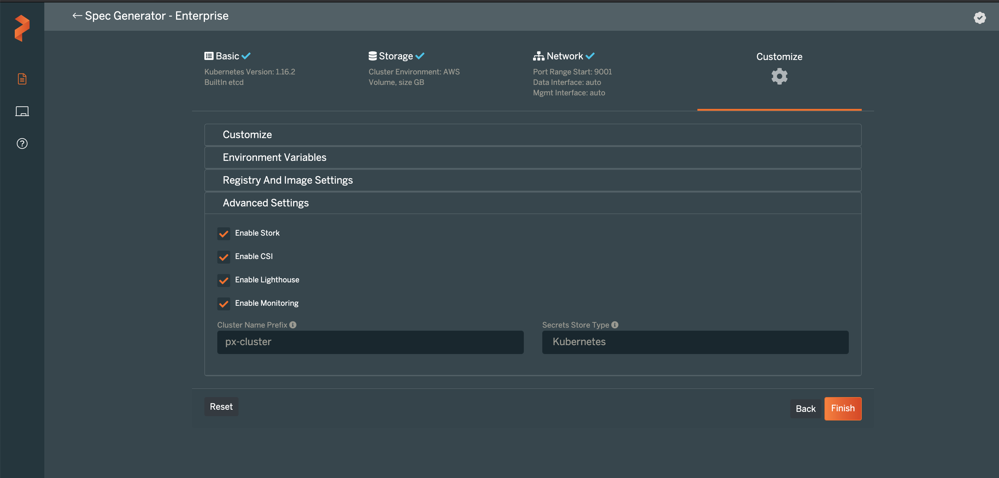

### Generating the Portworx Spec URL
* Launch the [spec generator](https://central.portworx.com/specGen/wizard)
* Select `New Spec` to generate spec for PortWorx:

* Select Enterprise Trial or Essentials:

* Enter the Kubernetes Version and the Portworx version to 1.16.2 and 2.5 respectively, select Built-in and press Next:

* Select `AWS` Cloud and enter disk size to be `500 GB` and option `Create using a spec`:

* Leave `auto` as the network interfaces and press Next:

* Select Openshift 4+ as Openshift version, go to Advanced Settings:

* In the Advanced Settings tab select CSI and Monitoring and press Finish:

* Copy Spec URL:

