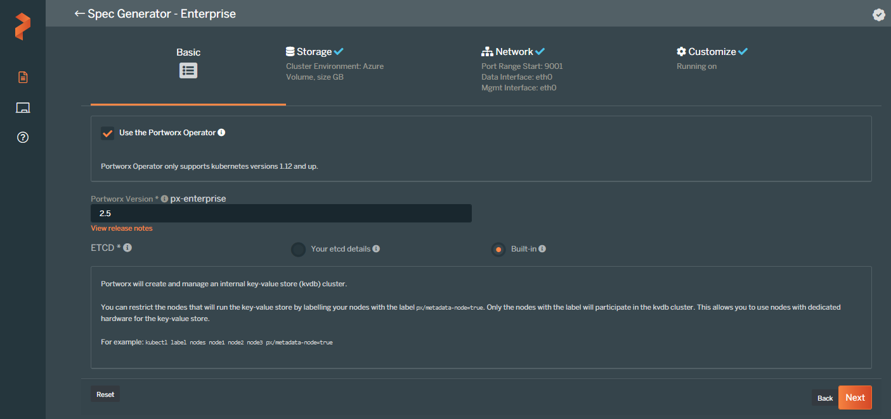

### Generating the Portworx Spec URL
* Launch the [spec generator](https://central.portworx.com/specGen/wizard)
* Select `Portworx Essentials` or `Portworx Enterprise` and press Next:

* Check `Use the Portworx Operator` box, select the `Portworx version` as `2.5`, select `Built-in` and then press Next:

* Select `Cloud` as your environment. Click on `Azure` and select `Create Using a Spec` option for `Select type of disk`.
Enter value for `Size(GB)` as `500` and then press Next.

* Enter `eth0` for the network interfaces and press Next:

* Select `Openshift 4+` as Openshift version, go to Advanced Settings:

* In the Advanced Settings tab select `CSI` and `Monitoring` and press Finish

* Copy the Spec URL:

