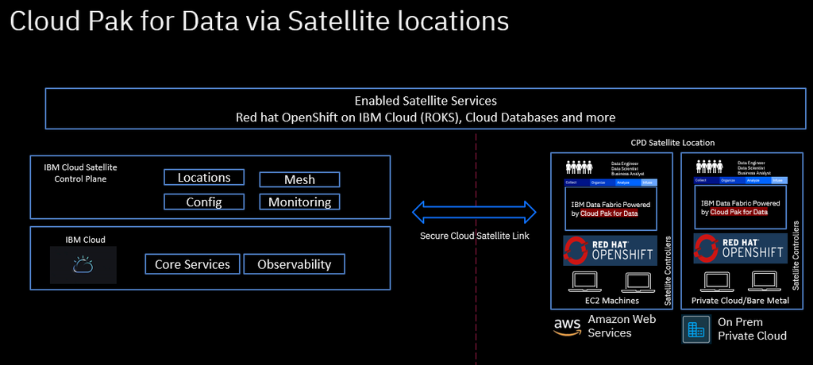

# Cloud Pak for Data on IBM Cloud Satellite locations

Cloud Pak for Data can also be installed on IBM Cloud Satellite locations on Amazon Web Services (AWS) and on-premises infrastructure. The support is now certified on CP4D v4.

With Cloud Pak for data support for IBM Cloud Satellite, you can now create a hybrid environment that brings the scalability and on-demand flexibility of public cloud services to the applications and data that run in your secure private on-prem hardware or even other clouds. With the recent work done, Cloud Pak for data has tested and certified AWS (Amazon Web Service) and On-Prem locations which essentially are the most often used combinations that we have seen in the market.  Now, data engineers, data stewards, data scientists, and business analysts can easily collaborate and deliver value in an integrated, secure hybrid-cloud data platform, close to where the organizations data resides and without much privacy and regulatory concerns which had been a bottleneck for Cloud Pak for Data customers, especially in telecommunications, financial services, healthcare and government sectors where data residency and its movements are tightly controlled.

Follow the documentations below for the detailed steps to install Cloud Pak for Data on supported satellite locations.

-   [IBM Cloud Satellite locations on AWS Infrastructure](./aws/README.md)
-   [IBM Cloud Satellite locations on On-Prem Infrastructure](./on-premises/README.md)