  

# Cloud Pak for Data on IBM Cloud Satellite locations using Azure Infrastructure

  This guide provides step-by-step instructions to install Cloud Pak for Data at IBM Cloud Satellite location using Microsoft Azure Infrastructure.  The Red Hat® OpenShift® cluster deployed here uses Red Hat® OpenShift® Data Foundation—previously Red Hat OpenShift Container Storage—which is a software-defined storage for containers.

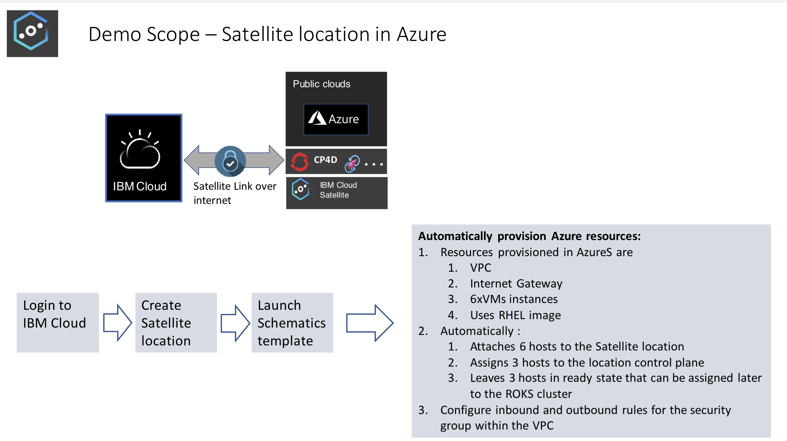

In order to deliver consistent experience across various form factors including Satellite locations, following capabilities have been certified by Cloud Pak for Data team on Cloud Pak for Data clusters deployed on IBM Cloud Satellite locations using Azure Infrastructure and ODF storage.

-   WKC
-   Watson Studio
-   Watson Query i.e Data Virtualization
-   Datastage
-   Db2
-   Db2 Warehouse
-   Cognos Analytics
-   Match 360 
-   Planning Analytics
-   Watson Discovery
-   Watson Assistant
  
  ## Steps to Deploy
  
  The following  are the steps to be followed to deploy 
  
1. [Creating a Satellite location in IBM Cloud using Azure infrastructure](#step-1-creating-a-satellite-location-in-ibm-cloud-using-azure-infrastructure)
2. [Create an OpenShift cluster at the location](#step-2-create-an-openshift-cluster-at-the-satellite-location)
3. [Configure storage](#step-3-configure-storage)
4. [Install Cloud Pak for Data](#step-4-install-cloud-pak-for-data)


## Prerequisites

Before you begin this process, you will need the following information:

- Azure ClientID, TenantID and Clientsecret ( AdministratorAccess policy is required for the IAM user who will be used for deploying the cluster.)

- Size of nodes to provision (CPU and RAM) (Minimum 16core\*64GB each node - Standard_D16as_v4)

- Every time we create satellite cluster by default 3 nodes are assigned to control plane and remaining will be worker nodes (minimum 3 worker nodes). Please refer to [Cloud Pak for data hardware requirements](https://www.ibm.com/docs/en/SSQNUZ_4.0/sys-reqs/hardware-reqs.html) to determine the number of master and worker nodes needed for the cluster.  Please ensure that you provision 3 additional nodes than the hardware requirements specified by the Cloud Pak for data requirements, as 3 nodes will be assigned to the IBM Cloud Satellite control plane.


## Step 1: Creating a Satellite location in IBM Cloud using Azure infrastructure


1. After logging on to [IBM Cloud](https://cloud.ibm.com/), from Menu, Select **Satellite** > **Locations** > **Create location**

When you select the **Azure template** you will need to provide your Azure **ClientID** ,**TenantID**  and **ClientSecret key**.

  

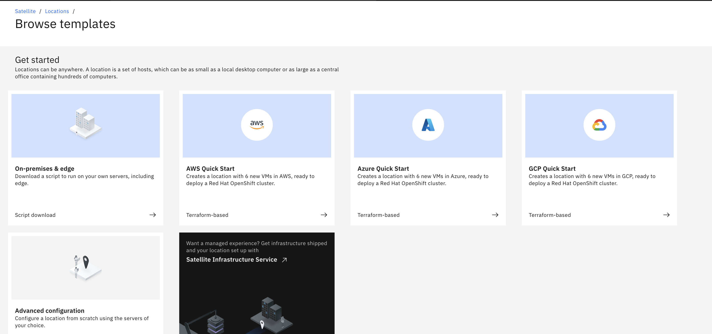


  

**Size of nodes to provision (CPU and RAM)**

  

The minimum requirement is 16 CPU X 64GB memory for each worker node on a Cloud Pak for Data cluster.  So your azure vms should be configured in such a way to offer mentioned configuration. (for example Standard_D4as_v4 for master, Standard_D16as_v4 for worker) & Also select RHEL 8 from the dropdown as shown below.


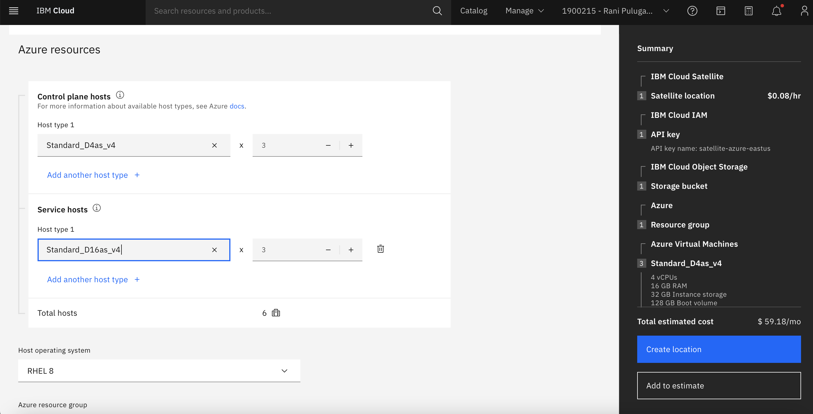

  

**Note**: You do not need to create Object storage as we will configure storage later. 

  

After you click Create, the azure vms are provisioned for you on Azure. This can take a while and you’ll know the hosts are ready when the Satellite Location status is Normal. For reference you can always check the logs in workspace. ( Schematics -> Workspaces). 

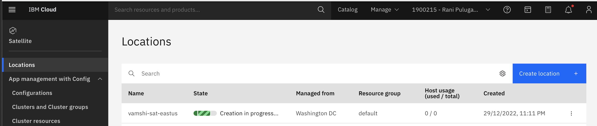

  
 

## Step 2: Create an OpenShift cluster at the satellite location

In the **Satellite > Cluster** page select **Create Cluster** then select **Satellite** as your infrastructure and then select your **Satellite Location**.

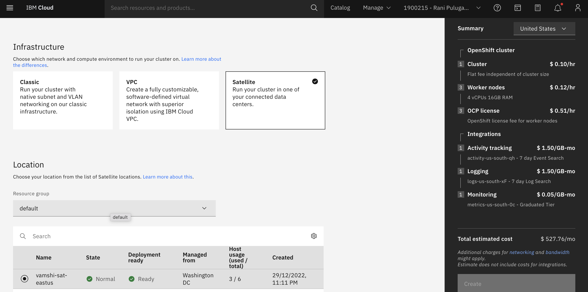

  
Click on "Get values from available hosts"
Click on "Set worker pool to match this host configuration"

Under Worker Pools, you also need to select the size of the nodes for your cluster and which zone they reside in.When the cluster is provisioned, it will use the number of nodes you specified from each selected zone as worker nodes.
<br>
Finally, click **Enable cluster admin access for Satellite Config** which ensures that all of the Satellite Config components will work, and then give your cluster a name.


  

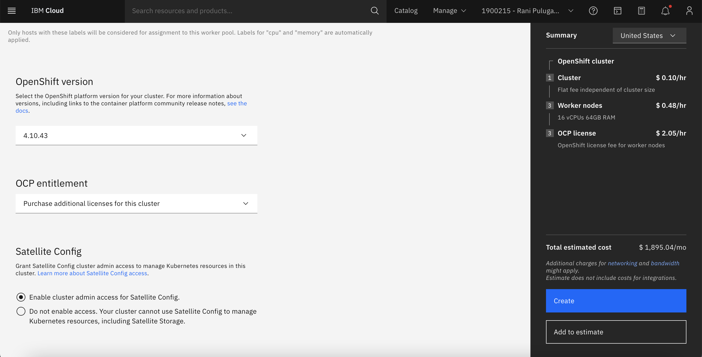

  

The cluster is ready when it shows as Active in the **Openshift clusters** page.

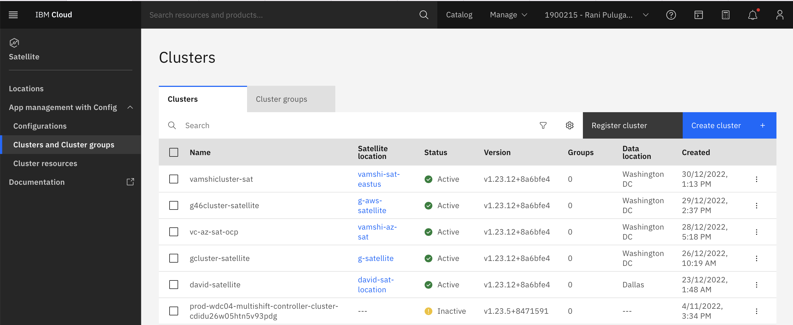

After the cluster is provisioned, in order to log in to the Openshift web console, we need to expose it to internet.

  

## Expose the cluster to internet
1. Check status:Go to the left navigation menu, on top left corner to the left of IBM Cloud and the click on Satellite Locations
    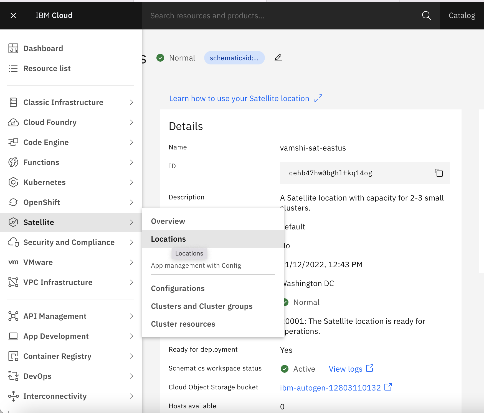
2. Click on the location
   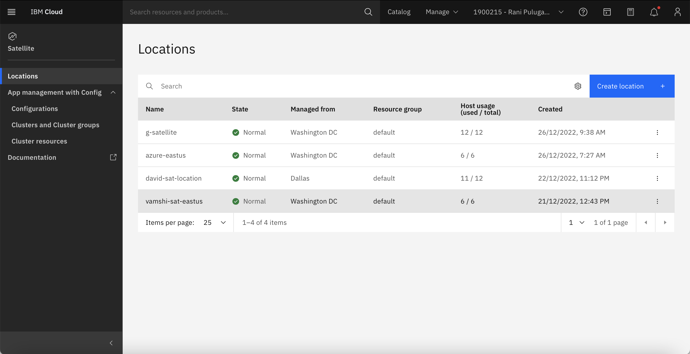
3. On the Overview page, you can see status is normal.
   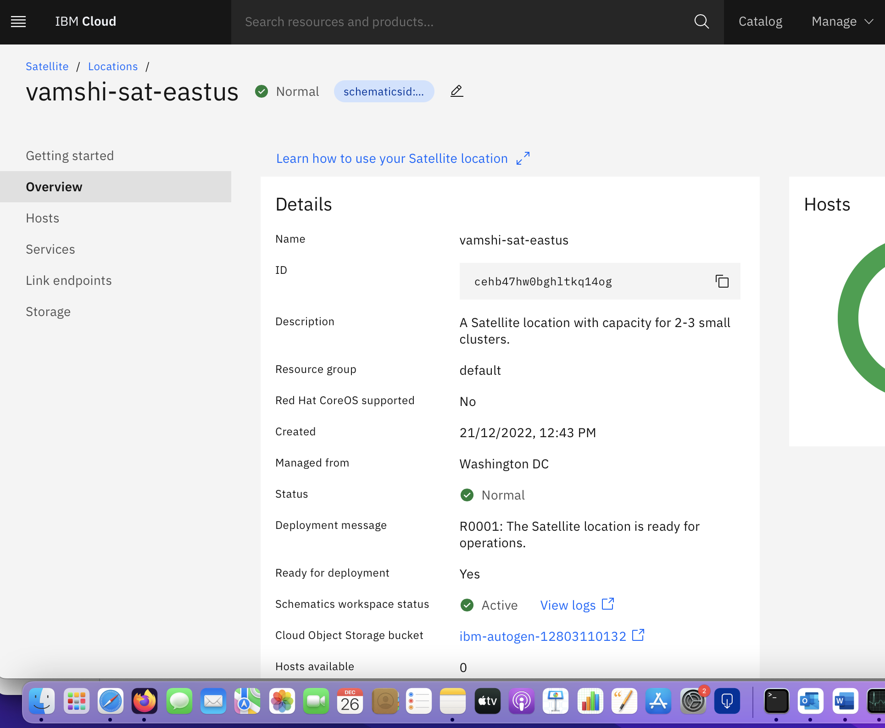
4. On left side click on Hosts to show the hosts attached to the location and all hosts in normal.
    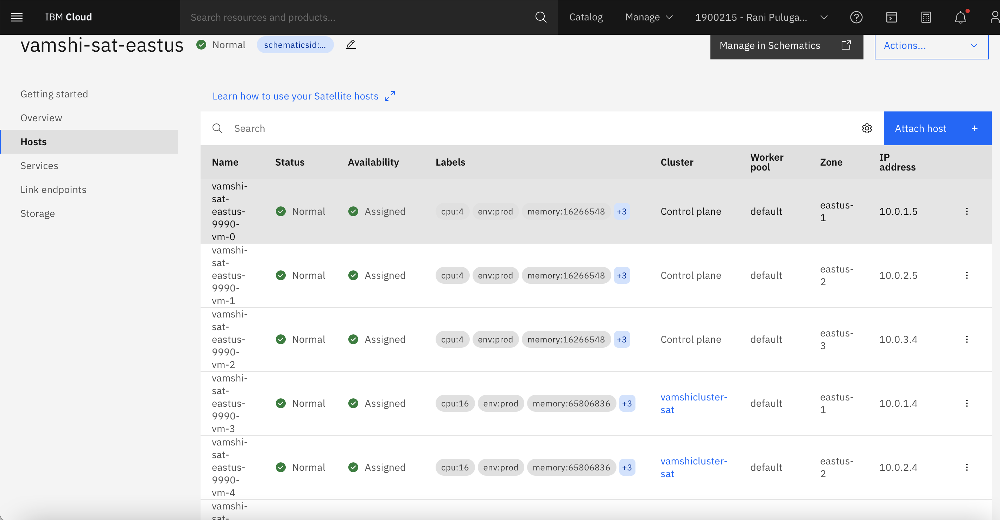
5. Review Cluster state:
    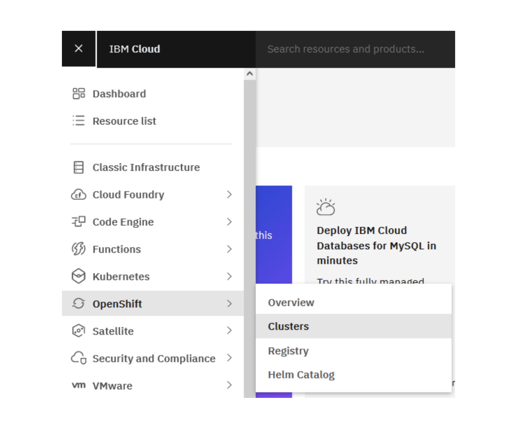
    
### Expose ROKS:

1. Login to Azure: [Login Azure](https://ibm-satellite.github.io/academy-labs/#/azure/AcademyLabs?id=login-to-azure)


2. Login to IBM Cloud: [Login IBM Cloud](https://ibm-satellite.github.io/academy-labs/#/azure/AcademyLabs?id=login-to-ibm-cloud) 


***Note***: ROKS services domains, like the console or API is configured with the private IPs of the Azure VMs, so if you try to access to the ROKS console or execute "oc" CLI from any place outside of the Azure subnet it is going to fail, you can not reach the private IPs.

```
		# user your values
	       clusterName=vamshicluster-sat
```

	

   If we check how IBM Cloud configure the DNS for the ROKS instance you will see the IPs are private, 10.x.x.x

 ```
	ibmcloud oc nlb-dns ls --cluster $clusterName
 ```

   Take note of the Hostname, we will use it later
3. Satellite location also has a DNS configuration, as we are going to change also the IPs of the control planes we will have to update also this configuration.


 ```
	 # user your values
	location=vamshi-sat-eastus

	ibmcloud sat location dns ls --location $location
 ```
 
 The output will be similar to
     
     
 ```
     	Retrieving location subdomains...
	OK
	Hostname                                                                                        Records                                                                                         SSL Cert Status   SSL Cert Secret Name                                          Secret Namespace
	j80e9ce1185365420fe2d-6b64a6ccc9c596bf59a86625d8fa2202-c000.us-east.satellite.appdomain.cloud   10.0.1.5,10.0.2.5,10.0.3.5                                                                      created           j80e9ce1185365420fe2d-6b64a6ccc9c596bf59a86625d8fa2202-c000   default
	j80e9ce1185365420fe2d-6b64a6ccc9c596bf59a86625d8fa2202-c001.us-east.satellite.appdomain.cloud   10.0.1.5                                                                                        created           j80e9ce1185365420fe2d-6b64a6ccc9c596bf59a86625d8fa2202-c001   default
	j80e9ce1185365420fe2d-6b64a6ccc9c596bf59a86625d8fa2202-c002.us-east.satellite.appdomain.cloud   10.0.2.5                                                                                        created           j80e9ce1185365420fe2d-6b64a6ccc9c596bf59a86625d8fa2202-c002   default
	j80e9ce1185365420fe2d-6b64a6ccc9c596bf59a86625d8fa2202-c003.us-east.satellite.appdomain.cloud   10.0.3.5                                                                                        created           j80e9ce1185365420fe2d-6b64a6ccc9c596bf59a86625d8fa2202-c003   default
	j80e9ce1185365420fe2d-6b64a6ccc9c596bf59a86625d8fa2202-ce00.us-east.satellite.appdomain.cloud   j80e9ce1185365420fe2d-6b64a6ccc9c596bf59a86625d8fa2202-c000.us-east.satellite.appdomain.cloud   created           j80e9ce1185365420fe2d-6b64a6ccc9c596bf59a86625d8fa2202-ce00   default
	
```
<br> Normally customer would have a VPN to Azure so they can reach private IPs. But for the lab we are going to assign Public IPs to the Azure VMs and reconfigure ROKS and Location domains to use those Public IPs. This is a workaround with some pain points, as for example when you replace a control plane the location domains are reconfigured with the public IPs

### Gather azure resource group and VMs prefix

The resource group is generated by the terraform template executed with Schematics, you can gather the name from the schematics workspace.
 

 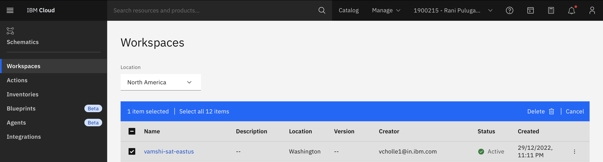
 
 Go to Settings
 
 
 
 And in variables look for "az_resource_group", in this case it is "vamshi-sat-eastus-2093"
 
 For the VMs prefix look for "az_resource_prefix", in this case it is "vamshi-sat-eastus-1974"
 
 ### Reconfigure with public IPs
 
 1. Configure this variables with your environment values
    
     ```
		#----> Replace with your values
		export SAT_RG=vamshi-sat-eastus-2093
		export VM_PREFIX=vamshi-sat-eastus-1974
		#-----
     ```
   
 2. Create public IPs
 
    ```
		az network public-ip create --resource-group $SAT_RG --name $VM_PREFIX-vm-0-public --version IPv4 --sku Standard --zone 1 2 3
		az network public-ip create --resource-group $SAT_RG --name $VM_PREFIX-vm-1-public --version IPv4 --sku Standard --zone 1 2 3
		az network public-ip create --resource-group $SAT_RG --name $VM_PREFIX-vm-2-public --version IPv4 --sku Standard --zone 1 2 3
		az network public-ip create --resource-group $SAT_RG --name $VM_PREFIX-vm-3-public --version IPv4 --sku Standard --zone 1 2 3
		az network public-ip create --resource-group $SAT_RG --name $VM_PREFIX-vm-4-public --version IPv4 --sku Standard --zone 1 2 3
		az network public-ip create --resource-group $SAT_RG --name $VM_PREFIX-vm-5-public --version IPv4 --sku Standard --zone 1 2 3
    ```
 3. Gather the generated IPs
    
    ```
		az network public-ip show -g $SAT_RG --name $VM_PREFIX-vm-0-public | grep ipAddress
		az network public-ip show -g $SAT_RG --name $VM_PREFIX-vm-1-public | grep ipAddress
		az network public-ip show -g $SAT_RG --name $VM_PREFIX-vm-2-public | grep ipAddress
		az network public-ip show -g $SAT_RG --name $VM_PREFIX-vm-3-public | grep ipAddress
		az network public-ip show -g $SAT_RG --name $VM_PREFIX-vm-4-public | grep ipAddress
		az network public-ip show -g $SAT_RG --name $VM_PREFIX-vm-5-public | grep ipAddress
		
    ```
 
 
The output will be similar to
  
  
   
   ```
		"ipAddress": "52.147.223.199",
		 "ipAddress": "52.149.232.46",
		 "ipAddress": "52.149.232.155",
		 "ipAddress": "52.149.233.12",
		 "ipAddress": "52.142.29.26",
		 "ipAddress": "52.142.29.170"
   ```
    
  4. Update VMs IP

	 ```
		az network nic ip-config update --name $VM_PREFIX-nic-internal --nic-name $VM_PREFIX-nic-0 --resource-group $SAT_RG --public-ip-address $VM_PREFIX-vm-0-public
		az network nic ip-config update --name $VM_PREFIX-nic-internal --nic-name $VM_PREFIX-nic-1 --resource-group $SAT_RG --public-ip-address $VM_PREFIX-vm-1-public
		az network nic ip-config update --name $VM_PREFIX-nic-internal --nic-name $VM_PREFIX-nic-2 --resource-group $SAT_RG --public-ip-address $VM_PREFIX-vm-2-public
		az network nic ip-config update --name $VM_PREFIX-nic-internal --nic-name $VM_PREFIX-nic-3 --resource-group $SAT_RG --public-ip-address $VM_PREFIX-vm-3-public
		az network nic ip-config update --name $VM_PREFIX-nic-internal --nic-name $VM_PREFIX-nic-4 --resource-group $SAT_RG --public-ip-address $VM_PREFIX-vm-4-public
		az network nic ip-config update --name $VM_PREFIX-nic-internal --nic-name $VM_PREFIX-nic-5 --resource-group $SAT_RG --public-ip-address $VM_PREFIX-vm-5-public
	 ```

5. You can check the network rules applied to each NIC with this command, the output is quite long, but we will focus on the first set of rules
     
     ```
     	az network nic list-effective-nsg --name $VM_PREFIX-nic-0 --resource-group $SAT_RG
     ```
 
 The output will be similar to
    
   
   ```
    {
        "access": "Allow",
        "destinationAddressPrefix": "0.0.0.0/0",
        "destinationAddressPrefixes": [
          "0.0.0.0/0",
          "0.0.0.0/0"
        ],
        "destinationPortRange": "80-80",
        "destinationPortRanges": [
          "80-80",
          "30000-32767",
          "443-443"
        ],
        "direction": "Inbound",
        "expandedDestinationAddressPrefix": null,
        "expandedSourceAddressPrefix": null,
        "name": "securityRules/satellite",
        "priority": 100,
        "protocol": "All",
        "sourceAddressPrefix": "0.0.0.0/0",
        "sourceAddressPrefixes": [
          "0.0.0.0/0",
          "0.0.0.0/0"
        ],
        "sourcePortRange": "0-65535",
        "sourcePortRanges": [
          "0-65535"
        ]
      }
....
  
 ```
    
    
 
 So communication is allowed from internet (0.0.0.0/0) to the ports 80, 443 and 30000-32767.
 


 6. Double check hosts used as control planes and as ROKS workers, look for this in the "hosts" section of the location in IBM Cloud console.
 
     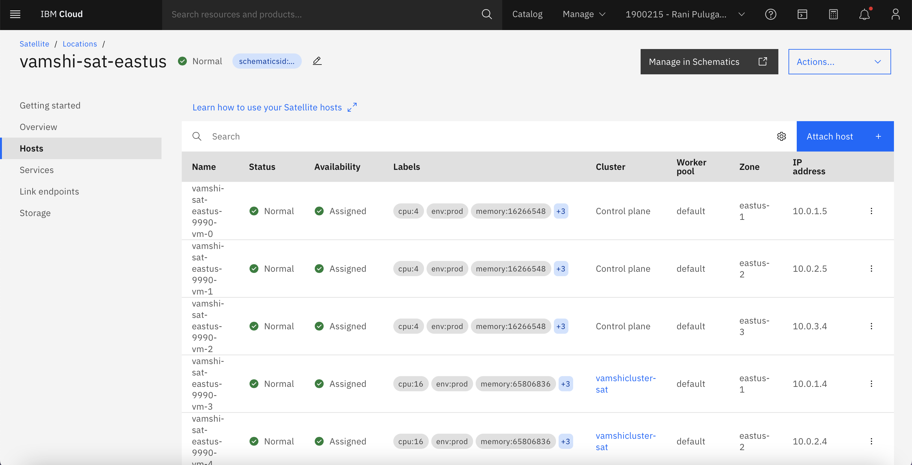


     So VMs 0,1 and 2 are control planes and 3, 4 and 5 are workers (are assigned to cluster "vamshicluster-sat")


These are the new IPs we generated:

 ```
  "ipAddress": "52.147.223.199",
  "ipAddress": "52.149.232.46",
  "ipAddress": "52.149.232.155",
  "ipAddress": "52.149.233.12",
  "ipAddress": "52.142.29.26",
  "ipAddress": "52.142.29.170"
 ```
 
7. Update location DNS IPs

   ```
	# user your values
	ip0=52.147.223.199
	ip1=52.149.232.46
	ip2=52.149.232.155
	# ----
   ```
   
   ```
   	ibmcloud sat location dns register --location $location --ip $ip0 --ip $ip1 --ip $ip2
   ```
   
 The output will be similar to
  
 
 ```
        vamshicholleti@vamshis-MacBook-Pro cp4d-deployment % ibmcloud sat location dns register --location $location --ip $ip0 --ip $ip1 --ip $ip2
	Registering a subdomain for control plane hosts...
	OK
	Subdomain                                                                                       Records
	vd619ba1abd2bf045d088-6b64a6ccc9c596bf59a86625d8fa2202-c000.us-east.satellite.appdomain.cloud   52.147.223.199, 52.149.232.46, 52.149.232.155
	vd619ba1abd2bf045d088-6b64a6ccc9c596bf59a86625d8fa2202-c001.us-east.satellite.appdomain.cloud   52.147.223.199
	vd619ba1abd2bf045d088-6b64a6ccc9c596bf59a86625d8fa2202-c002.us-east.satellite.appdomain.cloud   52.149.232.46
	vd619ba1abd2bf045d088-6b64a6ccc9c596bf59a86625d8fa2202-c003.us-east.satellite.appdomain.cloud   52.149.232.155
	vd619ba1abd2bf045d088-6b64a6ccc9c596bf59a86625d8fa2202-ce00.us-east.satellite.appdomain.cloud   vd619ba1abd2bf045d088-6b64a6ccc9c596bf59a86625d8fa2202-c000.us-east.satellite.appdomain.cloud
	(
```

8. It will take time for the global DNSs to update, if you ping to one of the previous domains now you will see the returned IP is the old one, give it some time
   
   ```
    	ping vd619ba1abd2bf045d088-6b64a6ccc9c596bf59a86625d8fa2202-c000.us-east.satellite.appdomain.cloud
   ```

  The output will be similar to
  
  ```
  	PING www-c000-cehb47hw0bghltkq14og.us-east-gtm01.akadns.net (10.0.3.4): 56 data bytes.
  ```
  
After some minutes
 
 
  ```
  	ping vd619ba1abd2bf045d088-6b64a6ccc9c596bf59a86625d8fa2202-c000.us-east.satellite.appdomain.cloud
	
	PING www-c000-cehb47hw0bghltkq14og.us-east-gtm01.akadns.net (52.149.232.46): 56 data bytes
  ```
  
9. Update ROKS DNS

   ```
   	ibmcloud ks cluster get --cluster $clusterName | grep "Ingress Subdomain"
   ```

The output will be similar to
  
  ```
  	Ingress Subdomain:             vamshicluster-sat-e49a84424f36ff1be278921955355233-0000.us-east.containers.appdomain.cloud
  ```
  
10. Set your values

   ```
   	
	# user your values
	roksDomain=vamshicluster-sat-e49a84424f36ff1be278921955355233-0000.us-east.containers.appdomain.cloud
  	ip3=52.149.233.12
	ip4=52.142.29.26 
	ip5=52.142.29.170
	
   ```

   ```
   	
	ibmcloud oc nlb-dns add --ip $ip3 --cluster $clusterName --nlb-host $roksDomain

	ibmcloud oc nlb-dns add --ip $ip4 --cluster $clusterName --nlb-host $roksDomain

	ibmcloud oc nlb-dns add --ip $ip5 --cluster $clusterName --nlb-host $roksDomain
   ```


11. Check the IPs

   ```
   	ibmcloud oc nlb-dns ls --cluster $clusterName
   
   ```
   
The output will be similar to
   
   ```
   	OK
	Hostname                                                                                     IP(s)                                                                 Health Monitor   SSL Cert Status   SSL Cert Secret Name                                      Secret Namespace    Status
	vamshicluster-sat-e49a84424f36ff1be278921955355233-0000.us-east.containers.appdomain.cloud   10.0.1.4,10.0.2.4,10.0.3.5,52.142.29.26,52.142.29.170,52.149.233.12   disabled         created           vamshicluster-sat-e49a84424f36ff1be278921955355233-0000   openshift-ingress   OK
	(
    
   ```
   
12. Remove private ones:

	```
	# user your values
	rmIp1=10.0.1.4
	rmIp2=10.0.2.4
	rmIp3=10.0.3.5
	# ---

	```
     
	```
	ibmcloud oc nlb-dns rm classic --ip $rmIp1 --cluster $clusterName --nlb-host $roksDomain

	ibmcloud oc nlb-dns rm classic --ip $rmIp2 --cluster $clusterName --nlb-host $roksDomain

	ibmcloud oc nlb-dns rm classic --ip $rmIp3 --cluster $clusterName --nlb-host $roksDomain	
	 ```


13. Check IPs
     
     ```
     	ibmcloud oc nlb-dns ls --cluster $clusterName
     ```

The output will be similar to

    
   ```
   	OK
	Hostname                                                                                     IP(s)                                      Health Monitor   SSL Cert Status   SSL Cert Secret Name                                      Secret Namespace    Status
	vamshicluster-sat-e49a84424f36ff1be278921955355233-0000.us-east.containers.appdomain.cloud   52.142.29.26,52.142.29.170,52.149.233.12   disabled         created           vamshicluster-sat-e49a84424f36ff1
   ```
    
    
14. Give it time to the cluster to update the Ingress Status, this message is just reporting, you can use the cluster normally.

    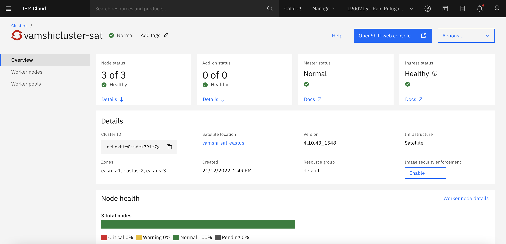
    
    
### Access OpenShift Console

Now login to IBM Cloud UI, and click on the cluster, then on the right, click on Manage cluster

   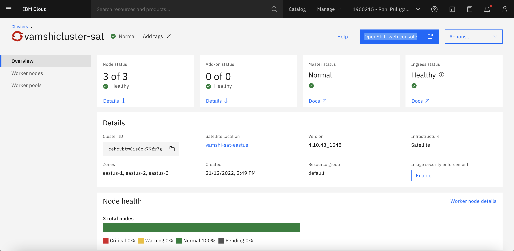

Here sometimes I faced authentication issue, I just loggedout / login and give a bit more time and then I could access.


##  Step 3: Configure storage

We will use Azure Disk CSI Driver as the storage for ODF, to use Azure Disk CSI Driver first we have to configure / deploy it to the ROKS cluster, then we will deploy ODF. <br><br>

#### Configure Azure Disks

We can create storage configurations by using the Satellite storage template for the storage provider or driver that we want to use, Azure Disk CSI Driver in this case. After you create a storage configuration by using a template, we can assign your storage configuration to your clusters or services. <br><br>

By using storage templates, you can create storage configurations that can be consistently assigned, updated, and managed across the clusters, service clusters, and cluster groups in your location.
 <br><br><br>
1. Click on Storage option and then click on "Create Storage Configuration"
  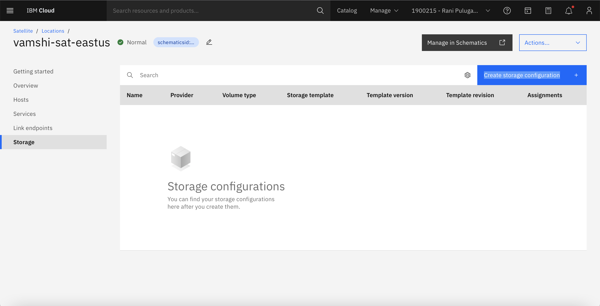
2. Choose the Azure Block CSI driver template from dropdown as shown below
  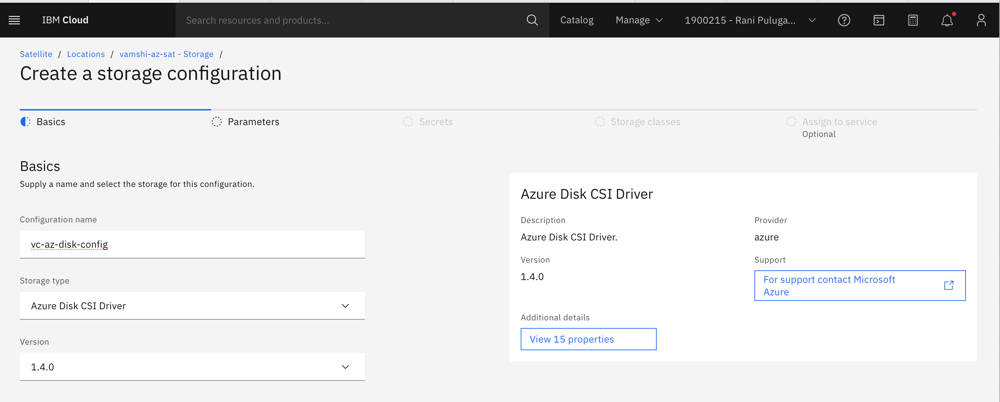
3. Update the Resourcegroup,vnetname, sgname and other params as shown below
  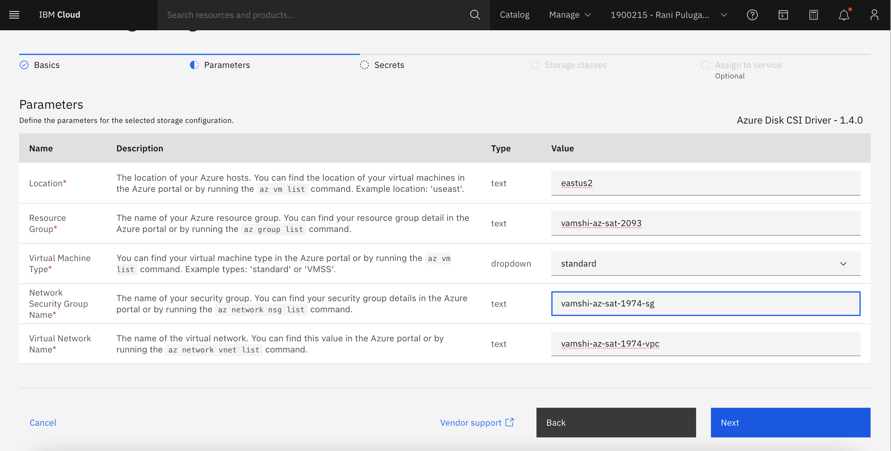
4. Update the Azure credentials to configure Azure disk service.
   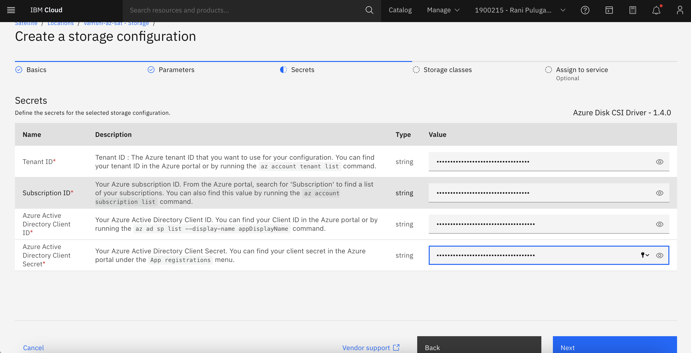
5. Check the Azure Storage classes 
   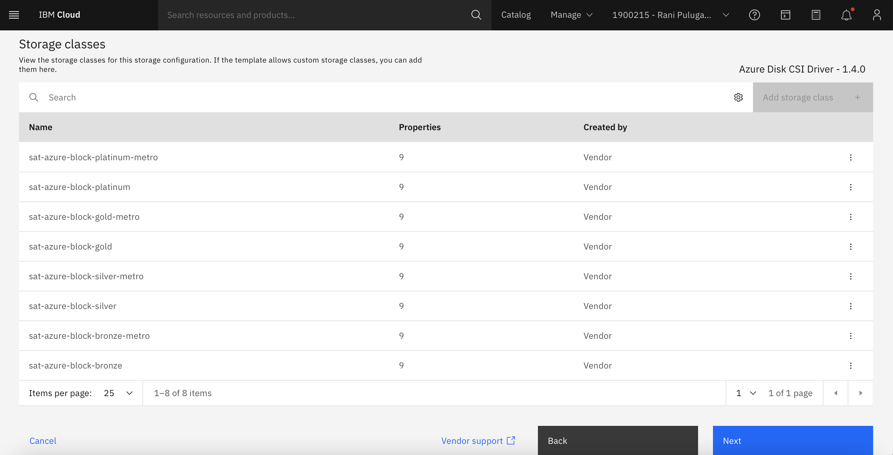
6. Assign Storage Configuration to Cluster and click on complete.
   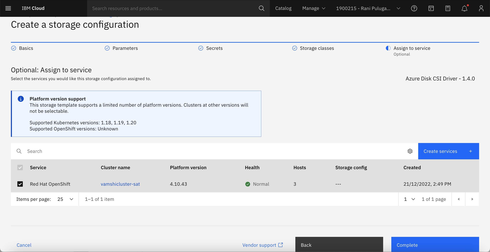
7. After sometime check storage pods and storage classes as shown below
    ```
    
    kubectl get pods -n kube-system | grep azure
	
	csi-azuredisk-controller-68698cd5cf-rbbgg            5/5     Running   0          62s
	csi-azuredisk-controller-68698cd5cf-tt2pd            5/5     Running   0          62s
	csi-azuredisk-node-4lslp                             3/3     Running   0          62s
	csi-azuredisk-node-lmqwr                             3/3     Running   0          62s
	csi-azuredisk-node-x6r5s                             3/3     Running   0          62s
   ```
   <br>
   Check Storage classess
   
   ```
	kubectl get sc

	NAME                                   PROVISIONER          RECLAIMPOLICY   VOLUMEBINDINGMODE      ALLOWVOLUMEEXPANSION   AGE
	sat-azure-block-bronze                 disk.csi.azure.com   Delete          Immediate              true                   3m39s
	sat-azure-block-bronze-metro           disk.csi.azure.com   Delete          WaitForFirstConsumer   true                   3m39s
	sat-azure-block-gold                   disk.csi.azure.com   Delete          Immediate              true                   3m40s
	sat-azure-block-gold-metro (default)   disk.csi.azure.com   Delete          WaitForFirstConsumer   true                   3m40s
	sat-azure-block-platinum               disk.csi.azure.com   Delete          Immediate              true                   3m40s
	sat-azure-block-platinum-metro         disk.csi.azure.com   Delete          WaitForFirstConsumer   true                   3m40s
	sat-azure-block-silver                 disk.csi.azure.com   Delete          Immediate              true                   3m39s
	sat-azure-block-silver-metro           disk.csi.azure.com   Delete          WaitForFirstConsumer   true                   3m40s
   ```
#### Configure ODF Storage 

Please follow below steps to configure ODF storage.
  
- Under the Satellite select "Storage" then click on "Create storage configuration":
  

- Edit preferences to Create Storage Configuration and click "Next":
  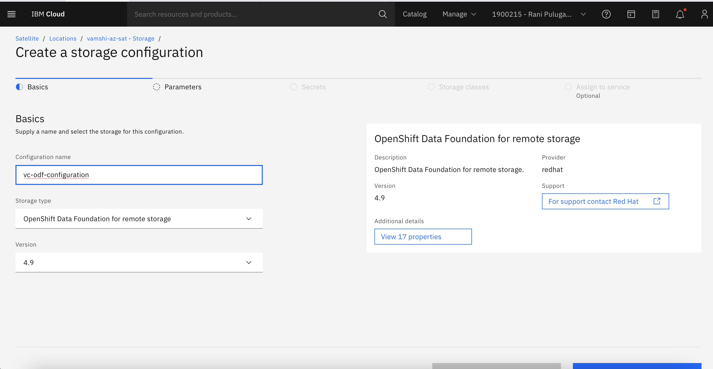
  
- Choose parameters as follows then click "Next":
  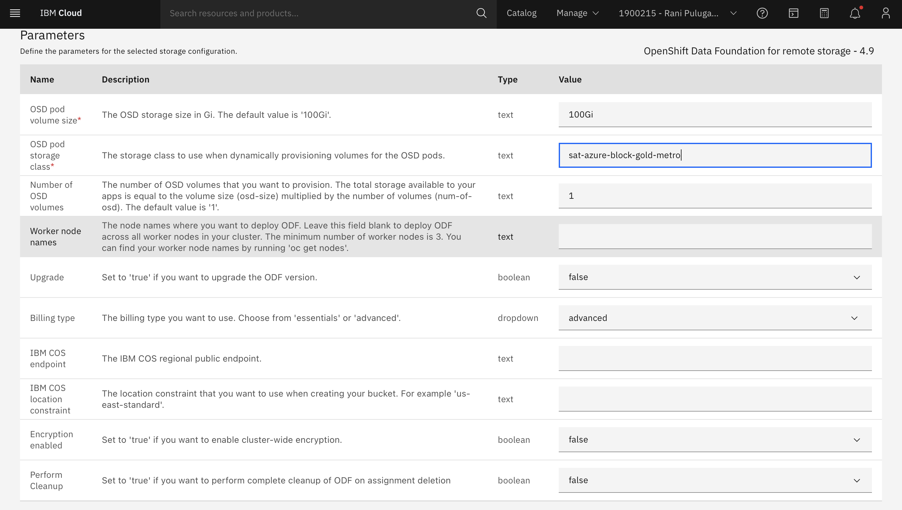
   **Note**: Update the Storage class name as "sat-azure-block-gold-metro" 
   
- Enter IAM API Key for your IBM Cloud account then click "Next":
   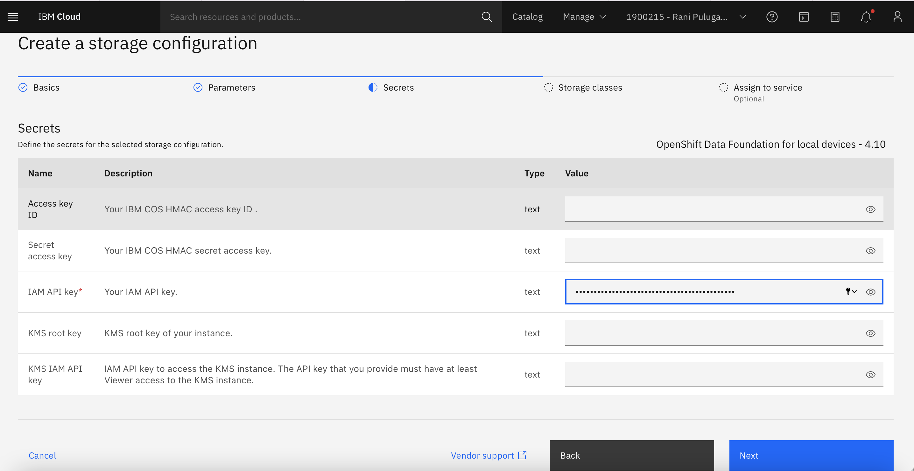
   
- Select the openshift storage to assign the ODF configuration to:
   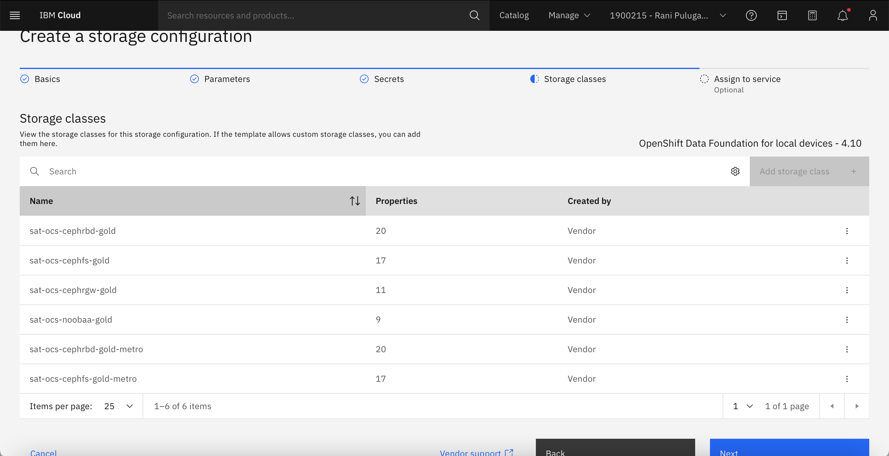
  
- Select the service you want this storage configuration assigned to.
   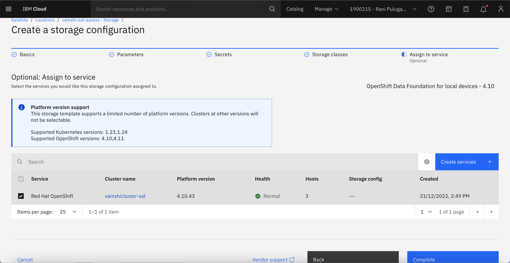
  
- Click on Complete and wait for 10-15 mins for the ODF configuration to be created on the openshift cluster.


```
	oc get csv -n openshift-storage
```

```
	oc get pods -n openshift-storage
```
<br>
please make sure these two storage classes were created successfully or not.

```
	Filestorage class: ocs-storagecluster-cephfs
	block storage: ocs-storagecluster-ceph-rbd 
```

The OCS cluster is also visible in the OpenShift web console. From the openshift-storage project, navigate to **Operators > Installed Operators > OpenShift Container Storage**.

 ## Step 4: Install Cloud Pak for Data

  

Now that we have configured storage on our cluster on our satellite location, we can install Cloud Pak for Data on it. When installing Cloud Pak for Data on a Satellite cluster, you can use the same instructions to install the Cloud Pak for Data instance that you would use if your OpenShift cluster was running as a managed service in IBM Cloud. The only difference is how you update pull secrets on the cluster nodes.  For updating the pull secrets on the cluster nodes please follow the below instruction:

  

**Steps to configure global pull secret**

  

The Cloud Pak for Data resources such as pods are set up to pull from the IBM Entitled Registry. This registry is secured and can only be accessed with your entitlement key. In order to download the images for the pods, your entitlement key needs to be configured in the config.json file on each worker node.  To update the config.json file on each worker node, use a daemonset.

  

First, you will need to create a secret with the entitlement key in the default namespace. You can get your entitlement key from <https://myibm.ibm.com/products-services/containerlibrary>.


```
oc create secret docker-registry docker-auth-secret \--docker-server=cp.icr.io \--docker-username=cp \--docker-password=<entitlement-key> \--namespace default

```
  

Once the secret is created, you can use a daemonset to update your worker nodes. If you choose to use a daemonset make sure it's working on each node prior to starting the installation.

  

**NOTE**: Below is an example of a daemonset yaml that can accomplish updating the global pull secret on each of your worker nodes.

	
```
cat <<EOF |oc apply -f -
apiVersion: apps/v1
kind: DaemonSet
metadata:
   name: update-docker-config
   labels:
     app: update-docker-config
spec:
   selector:
     matchLabels:
       name: update-docker-config
   template:
     metadata:
       labels:
         name: update-docker-config
     spec:
       initContainers:
         - command: ["/bin/sh", "-c"]
           args:
             - >
               echo "Backing up or restoring config.json";
               [[ -s /docker-config/config.json ]] && cp /docker-config/config.json /docker-config/config.json.bak || cp /docker-config/config.json.bak /docker-config/config.json;
               echo "Merging secret with config.json";
               /host/usr/bin/jq -s '.[0] * .[1]' /docker-config/config.json /auth/.dockerconfigjson > /docker-config/config.tmp;
               mv /docker-config/config.tmp /docker-config/config.json;
               echo "Sending signal to reload  crio config";
               pidof crio;
               kill -1 $(pidof crio)
           image: icr.io/ibm/alpine:latest
           imagePullPolicy: IfNotPresent
           name: updater
           resources: {}
           securityContext:
             privileged: true
           volumeMounts:
             - name: docker-auth-secret
               mountPath: /auth
             - name: docker
               mountPath: /docker-config
             - name: bin
               mountPath: /host/usr/bin
             - name: lib64
               mountPath: /lib64
       containers:
         - resources:
             requests:
               cpu: 0.01
           image: icr.io/ibm/alpine:latest
           name: sleepforever
           command: ["/bin/sh", "-c"]
           args:
             - >
               while true; do
                 sleep 100000;
               done
       hostPID: true
       volumes:
         - name: docker-auth-secret
           secret:
             secretName: docker-auth-secret
         - name: docker
           hostPath:
             path: /.docker
         - name: bin
           hostPath:
             path: /usr/bin
         - name: lib64
           hostPath:
             path: /lib64
             hostPathType: Directory
EOF

```
	
The daemonset schedules pod on every worker node and configures every worker node the ability to pull cloud pak for data images.


**Install Cloud Pak for Data:**

For installation of Cloud Pak for Data please refer to  [Installing  IBM Cloud Pak for Data](https://www.ibm.com/docs/en/cloud-paks/cp-data/4.6.x?topic=installing)

-----------------------------------------------------------------------------
