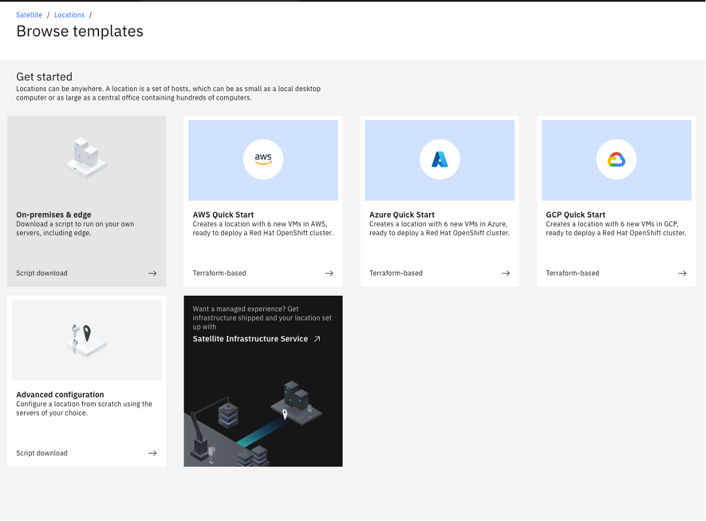
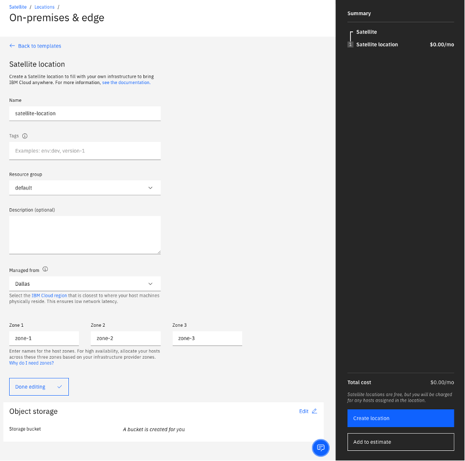
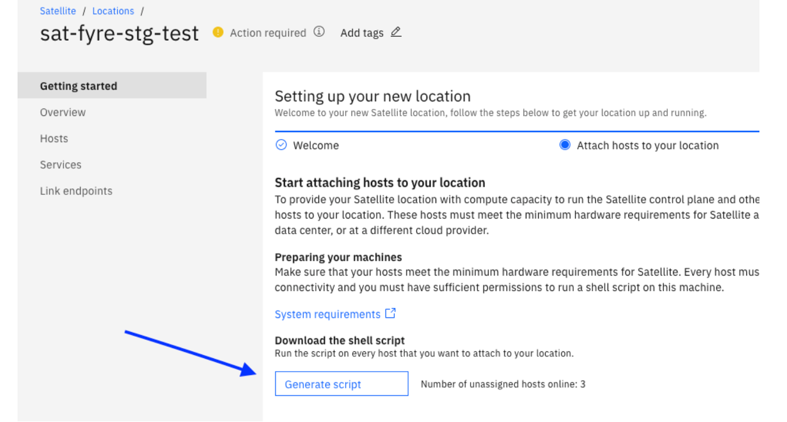
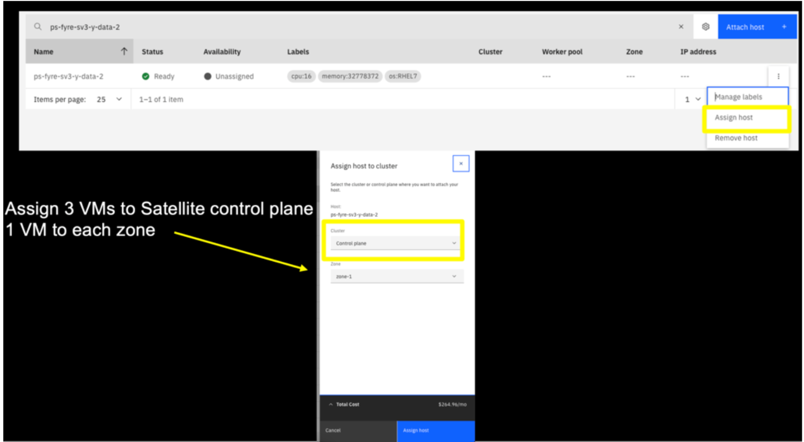
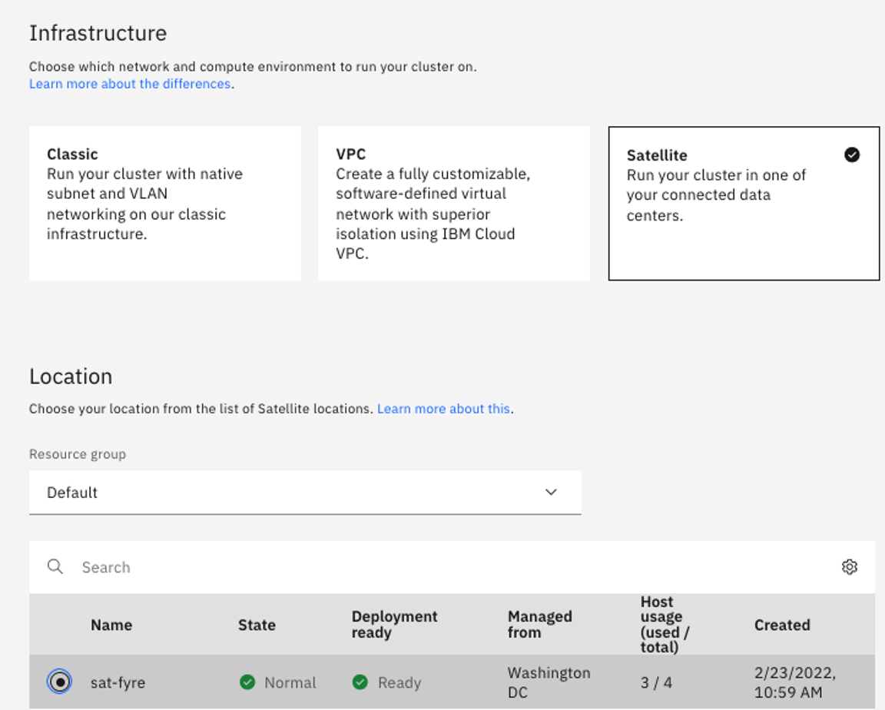
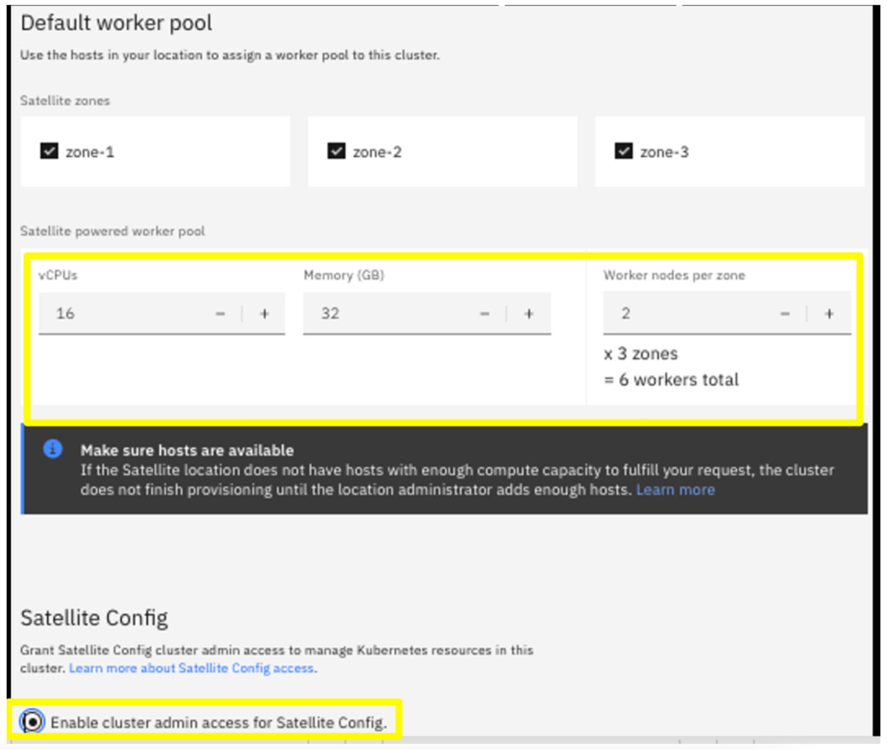

  

# Cloud Pak for Data on IBM Cloud Satellite locations using On-Prem Infrastructure

  

This guide provides step-by-step instructions to install Cloud Pak for Data at IBM Cloud Satellite location using On-Prem Infrastructure. The Red Hat® OpenShift® cluster deployed here uses Red Hat® OpenShift® Data Foundation—previously Red Hat OpenShift Container Storage—which is a software-defined storage for containers.

  

In order to deliver consistent experience across various form factors including Satellite locations, following capabilities have been certified by Cloud Pak for Data team on Cloud Pak for Data clusters deployed on IBM Cloud Satellite locations using On-Prem Infrastructure and ODF storage.

  

- WKC

- Watson Studio

- Watson Query i.e Data Virtualization

- Datastage

- Db2

- Db2 Warehouse

- Cognos Analytics

- Match 360

- Planning Analytics

- Watson Discovery

- Watson Assistant

## Steps to Deploy

The following are the steps to be followed to deploy:

1. [Create a satellite location](#1create-a-satellite-location)

2. [Provision host machines](#2-provision-host-machines)

3. [Update host machines](#3-update-the-host-machines)

4. [Assign hosts to Control Plane](#4-assign-the-control-plane-hosts-to-the-satellite-location)

5. [Assign hosts to OCP cluster](#5-assign-remaining-hosts-to-the-satellite-location-for-the-openshift-cluster)

6. [Install Red Hat Openshift](#6-create-openshift-cluster)

7. [Setup storage and install ODF](#7-install-openshift-data-foundation-odf-storage)

8. [Configuring OCP cluster pull secret](#8-configuring-your-cluster-pull-secret)

9. [Install Cloud Pak for Data](#9-install-cloud-pak-for-data)

  
  

### 1. Create a satellite location:

- Navigate to https://cloud.ibm.com/satellite/locations and click Create Location. Select On-premises & edge:




- Edit the name, location, and resource group as required:



  
  

- Generate and download the attach script after creating the location, this is to be run later on the on-premises VMs:



  

### 2. Provision host machines 

Host System Requirements:

Please refer to [Host system requirements](https://cloud.ibm.com/docs/satellite?topic=satellite-host-reqs) for requirements that relate to the computing and system setup of host machines for IBM Cloud Satellite®.  Hosts can be physical or virtual machines and must run Red Hat Enterprise Linux 7 or the latest Red Hat CoreOS on x86 architecture with the kernel that is distributed with that version

Please refer to [Cloud Pak for data hardware requirements](https://www.ibm.com/docs/en/SSQNUZ_4.0/sys-reqs/hardware-reqs.html) to determine the number of master and worker nodes needed for the cluster. Please ensure that you provision 3 additional hosts than the hardware requirements specified by the Cloud Pak for data requirements, as 3 nodes will be assigned to the IBM Cloud Satellite control plane.


Storage:

You can use OpenShift Data Foundation (ODF) storage, which means that each host that is included in the ODF storage cluster must have at least two raw unformatted unmounted disks attached.  The minimum requirements are 100 GB for disk 1 and 500 GB for disk 2 for each host.

TIP: If you have the available quota, it can be useful to provision an extra host or two to have in case you need to add additional worker nodes to your cluster or if one of the nodes fail.

  

### 3. Update the host machines:

 
In addition, because the machines are provisioned on premises, you need to update them to work with IBM Cloud Satellite:

```

yum -y update

yum -y install ftp

yum -y install bind-utils

```

Register the hosts with Red Hat subscription manager:

```

ftp ftp3.linux.ibm.com

cd redhat

get ibm-rhsm.sh

bye

chmod +x ibm-rhsm.sh

./ibm-rhsm.sh --register

(enter your RedHat subscription user id and password)

```

To enable SELINUX on the VMs: run the following commands on each VM

```

grep -E "^SELINUX=" /etc/selinux/config

grep -E "^SELINUX=" /etc/sysconfig/selinux

sed -i 's/SELINUX=disabled/SELINUX=permissive/g' /etc/selinux/config

sed -i 's/SELINUX=disabled/SELINUX=permissive/g' /etc/sysconfig/selinux

grep -E "^SELINUX=" /etc/selinux/config

grep -E "^SELINUX=" /etc/sysconfig/selinux

reboot

```

Finally, you need to refresh the subscription manager. See the Satellite documentation for the full list of subscription-manager commands that you must run.

Login after the reboot and issue the following commands:

```

subscription-manager refresh

subscription-manager repos --enable rhel-server-rhscl-7-rpms

subscription-manager repos --enable rhel-7-server-optional-rpms

subscription-manager repos --enable rhel-7-server-rh-common-rpms

subscription-manager repos --enable rhel-7-server-supplementary-rpms

subscription-manager repos --enable rhel-7-server-extras-rpms

```

### 4. Assign the control plane hosts to the satellite location:

Copy the attach script that you downloaded in step one from the Satellite location to each VM , make it executable, and run it.

Then in the satellite location "Hosts" tab, use the action menu for three of the Hosts to assign the node to the control plane, each in a separate "zone".



### 5. Assign remaining hosts to the satellite location for the OpenShift cluster:

- Repeat steps 3 and 4 with the remaining VMs.

  

### 6. Create OpenShift cluster:

Important: Wait until the Satellite Location state becomes: **Normal**


  

Before you create the OpenShift cluster.

Click Satellite > Locations > Getting started > Create cluster to create the OpenShift cluster, selecting Satellite as the Infrastructure, and selecting your Location.


  

In the **Default work pool**, select the CPU and Memory sizes that are less than or equal to the VMs you provisioned (i.e. don't select sizes that are bigger than the nodes available). Select the number of VMs to include as worker nodes in your cluster and select to **Enable cluster admin access**.


  

Note: After the nodes are assigned to the Location, either as a control plane or worker node, you can no longer ssh into them from your Terminal window. You can however access them the OpenShift console under Compute > Nodes > <node> > Terminal or log into the IBM Cloud CLI and use the oc debug node/<node-name> command.

  

### 7. Install Openshift Data Foundation (ODF) Storage:

Every Cloud Pak requires storage, and for our OpenShift cluster on Satellite Locations, we use OpenShift Data Foundation with local disks. In step two above, you configured your VMs with two additional raw unformatted disks that will be used by ODF.

The installation for ODF is now automated via the IBM Cloud Console
  
  - Under the Satellite select "Storage" then click on "Create storage configuration":
  
  
  
  - Edit preferences to Create Storage Configuration and click "Next":
  
  
  
  - Choose parameters as follows then click "Next": 
  
  
  
  - Enter IAM API Key for your IBM Cloud account then click "Next":
  
  
  
  - Select the openshift storage to assign the ODF configuration to: 

  

  NOTE: Please allow 10-20 minutes for the ODF configuration to be created on the openshift cluster.
  
  You can confirm that ODF has been deployed by running the following commands: 

```
root@crumbs31:~$ oc get sc
NAME                          PROVISIONER                             RECLAIMPOLICY   VOLUMEBINDINGMODE      ALLOWVOLUMEEXPANSION   AGE
localblock                    kubernetes.io/no-provisioner            Delete          WaitForFirstConsumer   false                  4d3h
ocs-storagecluster-ceph-rbd   openshift-storage.rbd.csi.ceph.com      Delete          Immediate              true                   4d3h
ocs-storagecluster-ceph-rgw   openshift-storage.ceph.rook.io/bucket   Delete          Immediate              false                  4d3h
ocs-storagecluster-cephfs     openshift-storage.cephfs.csi.ceph.com   Delete          Immediate              true                   4d3h
openshift-storage.noobaa.io   openshift-storage.noobaa.io/obc         Delete          Immediate              false                  4d3h
sat-ocs-cephfs-gold           openshift-storage.cephfs.csi.ceph.com   Delete          Immediate              true                   4d4h
sat-ocs-cephfs-gold-metro     openshift-storage.cephfs.csi.ceph.com   Delete          WaitForFirstConsumer   true                   4d4h
sat-ocs-cephrbd-gold          openshift-storage.rbd.csi.ceph.com      Delete          Immediate              true                   4d4h
sat-ocs-cephrbd-gold-metro    openshift-storage.rbd.csi.ceph.com      Delete          WaitForFirstConsumer   true                   4d4h
sat-ocs-cephrgw-gold          openshift-storage.ceph.rook.io/bucket   Delete          Immediate              false                  4d4h
sat-ocs-noobaa-gold           openshift-storage.noobaa.io/obc         Delete          Immediate              false                  4d4h
```
  
### 8. Configuring your cluster pull secret:

  

The Cloud Pak for Data resources such as pods are set up to pull from the IBM Entitled Registry. This registry is secured and can only be accessed with your entitlement key. In order to download the images for the pods, your entitlement key needs to be configured in the config.json file on each worker node. To update the config.json file on each worker node, use a daemonset.

First, you will need to create a secret with the entitlement key in the default namespace. You can get your entitlement key from https://myibm.ibm.com/products-services/containerlibrary.

Here’s the link to configure pull secret:

https://www.ibm.com/docs/en/cloud-paks/cp-data/4.0?topic=tasks-configuring-your-cluster-pull-images

```

oc create secret docker-registry docker-auth-secret \--docker-server=cp.icr.io \--docker-username=cp \--docker-password=<entitlement-key>  \--namespace default

```

Once the secret is created, you can use a daemonset to update your worker nodes. If you choose to use a daemonset make sure it's working on each node prior to starting the installation.

  

NOTE: Below is an example of a daemonset yaml that can accomplish updating the global pull secret on each of your worker nodes.

```
cat <<EOF |oc apply -f -
apiVersion: apps/v1
kind: DaemonSet
metadata:
   name: update-docker-config
   labels:
     app: update-docker-config
spec:
   selector:
     matchLabels:
       name: update-docker-config
   template:
     metadata:
       labels:
         name: update-docker-config
     spec:
       initContainers:
         - command: ["/bin/sh", "-c"]
           args:
             - >
               echo "Backing up or restoring config.json";
               [[ -s /docker-config/config.json ]] && cp /docker-config/config.json /docker-config/config.json.bak || cp /docker-config/config.json.bak /docker-config/config.json;
               echo "Merging secret with config.json";
               /host/usr/bin/jq -s '.[0] * .[1]' /docker-config/config.json /auth/.dockerconfigjson > /docker-config/config.tmp;
               mv /docker-config/config.tmp /docker-config/config.json;
               echo "Sending signal to reload  crio config";
               pidof crio;
               kill -1 $(pidof crio)
           image: icr.io/ibm/alpine:latest
           imagePullPolicy: IfNotPresent
           name: updater
           resources: {}
           securityContext:
             privileged: true
           volumeMounts:
             - name: docker-auth-secret
               mountPath: /auth
             - name: docker
               mountPath: /docker-config
             - name: bin
               mountPath: /host/usr/bin
             - name: lib64
               mountPath: /lib64
       containers:
         - resources:
             requests:
               cpu: 0.01
           image: icr.io/ibm/alpine:latest
           name: sleepforever
           command: ["/bin/sh", "-c"]
           args:
             - >
               while true; do
                 sleep 100000;
               done
       hostPID: true
       volumes:
         - name: docker-auth-secret
           secret:
             secretName: docker-auth-secret
         - name: docker
           hostPath:
             path: /.docker
         - name: bin
           hostPath:
             path: /usr/bin
         - name: lib64
           hostPath:
             path: /lib64
             hostPathType: Directory
EOF

```

### 9. Install Cloud Pak for Data:

To install Cloud Pak for Data starting from Setting Up Projects, follow the steps in the following link

https://www.ibm.com/docs/en/cloud-paks/cp-data/4.0?topic=tasks-setting-up-projects-namespaces

  

NOTE: At the step where you have to install IBM Cloud Pak foundational services, make sure to create an operator group

Here’s an example:

```
apiVersion: operators.coreos.com/v1
kind: OperatorGroup
metadata:
  name: operatorgroup
  namespace: ibm-common-services
spec:
  targetNamespaces:
    - ibm-common-services
```
