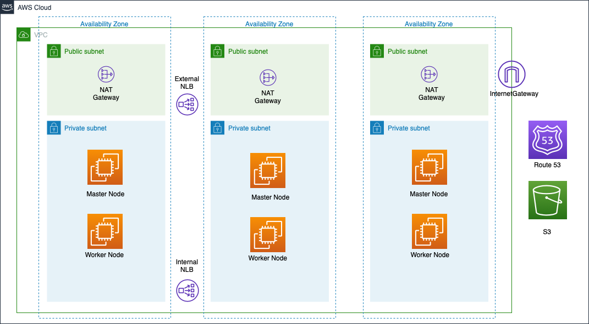

# AWS ROSA

### Architecture


### Enable ROSA
* Enable ROSA [here](https://console.aws.amazon.com/rosa/home)
* Get RedHat ROSA token [here](https://cloud.redhat.com/openshift/token/rosa)

### Prerequisites
* Install terraform using this [link](https://learn.hashicorp.com/tutorials/terraform/install-cli)
* Install `jq`
  ```bash
  wget https://github.com/stedolan/jq/releases/download/jq-1.6/jq-linux64
  mv jq-linux64 jq
  chmod +x jq
  mv jq /usr/bin
  ```
* Install `wget`, `htpasswd`, `python3` and `aws` CLIs:
  * RHEL:
  ```bash
  yum install wget jq httpd-tools python36 -y
  ln -s /usr/bin/python3 /usr/bin/python
  ln -s /usr/bin/pip3 /usr/bin/pip
  pip install awscli --upgrade --user
  pip install pyyaml
  ```

* Download Openshift CLI and move to `/usr/bin`:

  ```bash
  wget https://mirror.openshift.com/pub/openshift-v4/clients/ocp/4.8.11/openshift-client-linux-4.8.11.tar.gz
  tar -xvf openshift-client-linux-4.8.11.tar.gz
  chmod u+x oc kubectl
  sudo mv oc /usr/bin
  sudo mv kubectl /usr/bin
  oc version
  ```

### Steps to Deploy:
* AWS `Access key ID` and `Secret access key` will be required for the deployment. Also `AdministratorAccess` policy is required for the IAM user which will be used for deploying the cluster.
* Before deploying the infrastructure make sure you have `python3` installed in your local machine.
* Create a Route 53 domain.
* [Download](https://cloud.redhat.com/openshift/install/pull-secret) a pull secret. Create a Red Hat account if you do not have one.
* [Sign up](https://www.ibm.com/account/reg/us-en/signup?formid=urx-42212) for a Cloud Pak for Data Trial Key if you don't have the API key.
* If you choose Portworx as your storage class, see [Portworx documentation](PORTWORX.md) for generating `portworx spec url`.
* Clone this repository:
```bash
git clone <repo_url>
```
* Change the current directory to `aws/terraform/`:
```
cd cp4d-deployment/managed-openshift/aws/terraform/
```
* Read the license [here](https://www14.software.ibm.com/cgi-bin/weblap/lap.pl?li_formnum=L-DNAA-BZTPEW) and accept it by setting variable `accept_cpd_license` to `accept`.
* Edit `variables.tf` and provide values for all the configuration variables. See the [Variables documentation](VARIABLES.md) for more details.
* If you want to hide sensitive data such as access_key_id or secret_access_key, create a `aws.tfvars` file and write all the sensitive variables.
* You can use the `wkc-1az-ocs-new-vpc.tfvars` file in this folder with preset values for a cluster with WKC enabled on OCS storage on a new VPC cluster. Note that the `<required>` parameters need to be set.
* You can also edit `variables.tf` and provide values for all the configuration variables. See the [Variables documentation](VARIABLES.md) for more details.

* Deploy scripts by executing the one of following commands

If using the variables.tf file

```bash
terraform init
terraform apply | tee terraform.log
```

OR 

if you are using the `wkc-1az-ocs-new-vpc.tfvars` file

```bash
terraform init
terraform apply -var-file=wkc-1az-ocs-new-vpc.tfvars | tee terraform.log
```

### Destroying the cluster:
* When cluster created successfully, execute following commands to delete the cluster:
  ```bash
  terraform destroy
  ```
* If cluster creation fails, execute following commands to delete the created resources:
  ```bash
  cd installer-files && ./openshift-install destroy cluster
  terraform destroy -var-file="<Path To terraform.tfvars file>"
  ```

* If cluster creation fails, execute following commands to delete the created resources:
  ```bash
  cd installer-files && ./openshift-install destroy cluster
  terraform destroy 
  ```

### [OPTIONAL] Configuring your IDP (GitHub Enterprise)
* Click Settings → Developer settings → OAuth Apps → Register a new OAuth application.
* Enter an application name.
* Enter Homepage URL e.g `https://oauth-openshift.apps.femi-rosa.z2ri.p1.openshiftapps.com`
* Optional: Enter an application description.
* Enter the authorization callback URL, where the end of the URL contains the identity provider name e.g `https://oauth-openshift.apps.femi-rosa.z2ri.p1.openshiftapps.com/oauth2callback/github/`
* Click Register application. GitHub provides a Client ID and a Client Secret. You need these values to complete the identity provider configuration.
* In your terminal, run `rosa describe cluster --cluster <cluster_name> | grep Details` to view the admin page of the cluster. Follow the link to the cluster and create OAuth using these generated information.
  * For the Hostname field enter the Enterprise hostname, e.g. github.ibm.com
* Grant admin priviledges to a user in the github org/team you provided through the admin page.

### Helpful Commands
* RedHat Cluster management url:
```bash
rosa describe cluster --cluster <cluster_name> | grep Details
```
* Scale up worker nodes:
```bash
$ rosa list machinepools --cluster=<cluster_name>
$ rosa edit machinepool --cluster=<cluster_name> <machinepool_ID> --replicas=<number>
```
* Enable Autoscaling:
```bash
$ rosa list machinepools --cluster=<cluster_name>
$ rosa edit machinepool --cluster=<cluster_name> <machinepool_ID> --enable-autoscaling --min-replicas=<number> --max-replicas=<number>
```
* Disable Autoscaling:
```bash
$ rosa edit machinepool --cluster=<cluster_name> <machinepool_ID> --enable-autoscaling=false --replicas=<number>
```

### Pricing Information for ROSA
1. An hourly fee for the cluster would be $0.03/cluster/hour ($263/cluster/year)
1. Pricing per worker node would be $0.171 per 4vCPU/hour for on-demand consumption (~$1498/node/year)
    * This can be reduced by committing to a year in advance, $0.114 per 4vCPU/hour for a 1-year commit (~$998/node/year)

Note: Pricing for ROSA is in addition to the costs of Amazon EC2 & AWS services used.

E.g. If you have 10 m5.xlarge worker node cluster running on-demand for a year,
Cost would be,

  1. $0.03/cluster/hour X 1 cluster X 24 hours/day X 365 days/year = $263
  1. $0.171/node/hour X 10 worker nodes X 24 hours/day X 365 days/year = $14,990
  Total is approximately $15,253

Note: Above pricing does not include infrastructure expenses. For more information [here](https://aws.amazon.com/rosa/pricing/)
