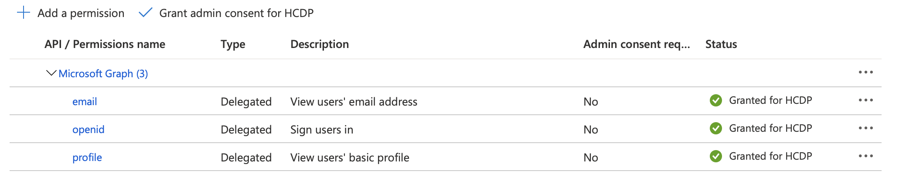

# Configure SSO

## Prerequisite: Add API permission to the service principal

* Log in to Azure Portal
* Go to Azure Active Directory
* Click App registrations
* Click "All applications"
* Search for the Service Principal used to deploy the cluster
* Click "View API permission"
* Click "Add a permission"
* Click "Microsoft Graph"
* Click "Delegated Permissions"
* Click the OpenId dropdown and check email, openid and profile
* Click the "Add permission" button at the bottom.
* Click "Grant admin consent ..."
A green checkmark is shown under Status as indicated below:



## Steps:
* Get Callback URL:
    ```bash
    oauthCallBack=`oc get route oauth-openshift -n openshift-authentication -o jsonpath='{.spec.host}'`
    oauthCallBackURL=https://$oauthCallBack/oauth2callback/AAD
    ```
* Add the Callback URL to the Service Principal
  * Go to Azure Active Directory
  * Click App registration
  * Click on "all-in-one-sp" under all applications
  * Under Overview, click right top corner link for "Add a Redirect URI"
  * Click "Add a platform"
  * Click Web Application from the list of Configure platforms
  * Enter the value of the $oauthCallBackURL from the previous step to the "Redirect URIs"
  * Click configure
* Update AppID token to enable UPN and Email
  * Create Manifest file:
    ```bash
    cat > manifest.json<< EOF
    [{ "name": "upn",
    "source": null,
    "essential": false,
    "additionalProperties": []
    },
    { "name": "email",
    "source": null,
    "essential": false,
    "additionalProperties": []
    }]
    EOF
    ```
  * Update token:
    ```bash
    az ad app update --set optionalClaims.idToken=@manifest.json --id <Service Principal appId>
    ```
* Create AppID secret:
    ```bash
    oc create secret generic openid-client-secret-azuread --namespace openshift-config --from-literal=clientSecret="<service_principal_password>"
    ```
* Create Oauth Configuration:
```bash
cat > openid.yaml<< EOF
apiVersion: config.openshift.io/v1
kind: OAuth
metadata:
  name: cluster
spec:
  identityProviders:
  - name: AAD
    mappingMethod: claim
    type: OpenID
    openID:
      clientID: "<client_id>"
      clientSecret:
        name: openid-client-secret-azuread
      extraScopes:
      - email
      - profile
      extraAuthorizeParameters:
        include_granted_scopes: "true"
      claims:
        preferredUsername:
        - email
        - upn
        name:
        - name
        email:
        - email
      issuer: "https://login.microsoftonline.com/<tenant_id>"
EOF
```
  * Update the Client ID and Tenant ID placeholders in the file.
  * Apply:
  ```bash
  oc apply -f openid.yaml
  ```

NOTE: You will have to grant RBAC permissions to individual users.
For example, to grant a user admin priviledges:
```bash
oc adm policy add-cluster-role-to-user cluster-admin 'user@ibm.com'
```

For more information: https://www.openshift.com/blog/openshift-blog-aro-aad