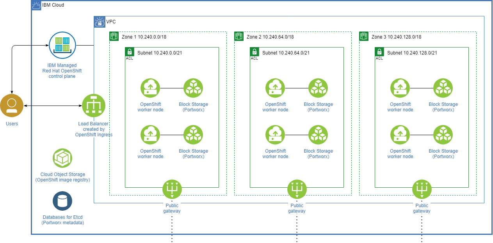

# Cloud Pak for Data 4.0 on Red Hat OpenShift on IBM Cloud

[IBM Cloud Pak for Data](https://www.ibm.com/ca-en/products/cloud-pak-for-data) is an end-to-end platform that helps organizations in their journey to AI. It enables data engineers, data stewards, data scientists, and business analysts to collaborate using an integrated multiple-cloud platform. Cloud Pak for Data uses IBM’s deep analytics portfolio to help organizations meet data and analytics challenges. The required building blocks (collect, organize, analyze, infuse) for information architecture are available using Cloud Pak for Data on IBM Cloud.

This deployment guide provides instructions for deploying Cloud Pak for Data on managed Red Hat OpenShift on IBM Cloud (formerly known as ROKS) using Terraform.

- [Costs and licenses](#costs-and-licenses)
- [Deployment topology](#deployment-topology)
- [Cloud Pak for Data services](#cloud-pak-for-data-services)
- [Instructions](#instructions)
  * [Building the Terraform environment container](#building-the-terraform-environment-container)
  * [Installing Cloud Pak for Data](#installing-cloud-pak-for-data)
  * [Securing your VPC and cluster](#securing-your-vpc-and-cluster)
  * [Deploying in an existing VPC](#deploying-in-an-existing-vpc)
  * [Deploying in an existing OpenShift cluster](#deploying-in-an-existing-openshift-cluster)
- [Troubleshooting](#troubleshooting)
  * [View detailed install logs](#view-detailed-install-logs)
  * [Common errors](#common-errors)
- [Coming soon](#coming-soon)

## Costs and licenses

These scripts create resources on IBM Cloud. For cost estimates, see the pricing pages for each IBM Cloud service that will be enabled. This deployment lets you use the OpenShift license bundled with your Cloud Pak entitlement. Portworx Enterprise is installed from the IBM Cloud catalog and a separate subscription from Portworx is not required.

You must have a Cloud Pak for Data entitlement API key to download images from the IBM entitled Cloud Pak registry. If you don't have a paid entitlement, you can create a [60 day trial subscription key](https://www.ibm.com/account/reg/us-en/signup?formid=urx-42212). You can retrieve your entitlement key from the [container software library](https://myibm.ibm.com/products-services/containerlibrary).

**Note**: After 60 days, contact [IBM Cloud Pak for Data sales](https://www.ibm.com/account/reg/us-en/signup?formid=MAIL-cloud).

## Deployment topology

The deployment creates the following resources.

* A [Virtual Private Cloud (Gen 2)](https://cloud.ibm.com/docs/vpc/vpc-getting-started-with-ibm-cloud-virtual-private-cloud-infrastructure) spanning one or three zones with a public gateway and private subnet in each zone.

* A [Red Hat OpenShift on IBM Cloud](https://www.ibm.com/ca-en/cloud/openshift) cluster.

* One [block storage](https://cloud.ibm.com/docs/vpc?topic=vpc-block-storage-about) volume attached to each worker node.

* [Portworx Enterprise](https://cloud.ibm.com/catalog/services/portworx-enterprise#about) running highly-available software-defined persistent storage.

* A managed database service ([Databases for Etcd](https://cloud.ibm.com/docs/databases-for-etcd)) for Portworx cluster metadata to keep the metadata separate from application data (optional).

* A [Cloud Object Storage](https://cloud.ibm.com/docs/cloud-object-storage) instance to back up the internal registry of your cluster.

Refer to [Quotas and service limits](https://cloud.ibm.com/docs/vpc?topic=vpc-quotas&locale=en) and ensure that your IBM Cloud account has sufficient resource quotas available.

Refer to [User access permissions](https://cloud.ibm.com/docs/openshift?topic=openshift-access_reference&locale=en) to verify that your account has been assigned the necessary IBM Cloud IAM permissions to create the resources in the deployment.

## Cloud Pak for Data services

As part of the deployment, any of the following services can be installed. For more information about available services, visit the [Cloud Pak for Data services catalog](https://www.ibm.com/support/producthub/icpdata/docs/content/SSQNUZ_latest/svc-nav/head/services.html).

* Cloud Pak for Data Bedrock Services
* Data Virtualization
* Watson Knowledge Catalog
* Watson Studio
* Watson Machine Learning
* Watson OpenScale
* Db2
* Data Refinery
* Db2 Data Management Console

the following services will be supported soon - 
* Cognos Dashboard Engine
* Analytics Engine powered by Apache Spark
* Streams
* DataStage
* Db2 Warehouse
* Db2 Data Gate
* Decision Optimization
* Cognos Analytics
* SPSS Modeler
* Db2 Big SQL
* Watson Studio Local RStudio
* Hadoop Execution Addon
* Jupyter Python 3.7 Runtime Addon

## Instructions

### Building the Terraform environment container

It is recommended that these scripts be executed from a Docker container to ensure that the required tools and packages are available. Docker can be installed for your system using instructions found [here](https://docs.docker.com/get-docker/). This deployment has been tested using Docker version 19.03.13.

**To create mulitple clusters, clone the repo again in a new directory and create a new container (with a --name other than 'my-container'). Do not bind multiple containers to the same host template directory.**

1. Clone this repo.

2. Navigate to the directory containing this README.

2. Run `docker build . -t cpd-roks-terraform`.

3. Run `docker run -d --name my-container --mount type=bind,source="$(pwd)",target=/root/templates cpd-roks-terraform`.

The current directory on the host has beeen bind-mounted to `~/templates` in the container. This allows file changes made in the host to be reflected in the container and vice versa.

### Deploying Cloud Pak for Data

1. Copy `terraform.tfvars.template` to `terraform.tfvars`. This file can be used to define values for variables. Refer to [VARIABLES.md](VARIABLES.md) and [vars.tf](vars.tf) for a list of available variables.

2. Log in to your container with `docker exec -it my-container bash --login`.

3. Run `terraform init`.

4. Run `terraform apply`.

### Securing your VPC and cluster

This deployment installs an OpenShift cluster in a VPC with permissive network access policies. To control traffic to your cluster, see [Securing the cluster network](https://cloud.ibm.com/docs/openshift?topic=openshift-vpc-network-policy).

### Deploying in an existing VPC

These templates can be used to install Cloud Pak for Data in an existing VPC on your account by providing values for the following variables.

* `existing_vpc_id`
* `existing_vpc_subnets` — A list of subnet IDs in your VPC in which to install the cluster. Every subnet must belong to a different zone. Thus, in a non-multizone deployment only supply one subnet in a list. Public gateways must be enabled on all provided subnets.
* `multizone`

When installing in an existing VPC, all other VPC configuration variables such as `enable_public_gateway`, `allowed_cidr_range`, `acl_rules` are ignored.

### Deploying in an existing OpenShift cluster

These templates can also deploy Cloud Pak for Data on an existing VPC Gen 2 OpenShift on IBM Cloud cluster. In addition to the values in the "Deploying in an existing VPC" section, provide values for the following variables.

* `existing_roks_cluster` — Name or ID of the cluster to deploy in. It is assumed that Portworx has *not* already been installed on this cluster. All worker nodes will be used.

### Replace / Upgrading worker nodes

In VPC Gen2 clusters, if you want to replace/upgrade the worker node which has block storage attached, this script can be used instead of doing it from IBM cloud console.
https://github.com/mumutyal/px-utils/blob/master/px_vpc_upgrade/vpc_upgrade_util.sh

usage: ./vpc_upgrade.sh clustername replace/upgrade workerid

If we do replace/upgrade from IBM cloud console, block storage would get detached and portwox will consider that node as storageless. The data stored in the block storage would not be available to the application

## Troubleshooting

Open an Issue in this repo that describes the error.

### Common errors

Resource provisioning can fail due to random errors such as latency timeouts, tokens expiring prematurely or cloud resources failing to stabilize. To let Terraform retry the failed resource and continue with the remainder of the deployment, run `terraform apply` again. Alternatively, you can run `terraform destroy` and start from the beginning.

* #### Errors with `docker` commands

  Ensure that your system has the latest version of Docker installed.

* #### `Error: timeout while waiting for state to become 'Ready'` for the resource `module.roks.ibm_container_vpc_cluster.this`

  This error happens when it takes longer than usual for the cluster ingress domain to be created.
  1. Open the IBM Cloud [OpenShift clusters](https://cloud.ibm.com/kubernetes/clusters?platformType=openshift) console and verify that the state of your cluster is "Normal". If there is an error, contact support or run `terraform destroy` and try again.
  2. Run `terraform untaint module.roks.ibm_container_vpc_cluster.this` to mark the resource as successful.
  3. Run `terraform apply` again. The deployment will continue onwards.

* #### `Unable to connect to the server: dial tcp: lookup c100-e.us-east.containers.cloud.ibm.com on 192.168.65.1:53: read udp 172.17.0.2:33170->192.168.65.1:53: i/o timeout` for the resource `module.portworx.ibm_resource_instance.portworx`

  1. Run `portworx/scripts/portworx_wait_until_ready.sh`. If the script prints an error, run `terraform destroy` and try the deployment again.
  2. Else, run `terraform untaint module.portworx.ibm_resource_instance.portworx` to mark the resource as successful.
  3. Run `terraform apply`. The deployment will continue onwards.

## Coming soon

* Support for application access restrictions based on `allowed_cidr_range`
* Support for additional Cloud Pak for Data services
* Support for IBM Key Protect volume encryption at deploy time.
