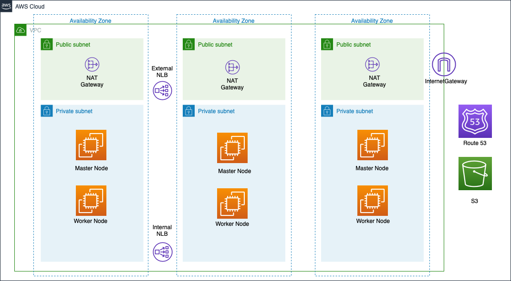

# Cloud Pak for Data 4.0 on AWS

## Deployment Topology:

Deploying this template builds the following Cloud Pak for Data cluster in single zone or multi zone.



The deployment sets up the following as shown in the diagram.
 - A highly available architecture that spans one or three Availability Zones.
 - A VPC configured with public and private subnets according to AWS best practices, to provide you with your own virtual network on AWS.
 - In the public subnets:
   - Managed network address translation (NAT) gateways to allow outbound internet access for resources in the private subnets.
 - In the private subnets:
   - OCP master instances up to three Availability Zones
   - OpenShift Container Platform (OCP) compute nodes.
   - Elastic Block Storage disks that are mounted on the compute nodes for container persistent data.
 - A Classic Load Balancer spanning the public subnets for accessing Cloud Pak for Data from a web browser. Internet traffic to this load balancer is only permitted from ContainerAccessCIDR.
 - A Network Load Balancer spanning the public subnets for accessing the OCP master instances. Internet traffic to this load balancer is only permitted from RemoteAccessCIDR.
 - A Network Load Balancer spanning the private subnets for routing internal OpenShift application programming interface (API) traffic to the OCP master instances.
 - Amazon Route 53 as your public Domain Name System (DNS) for resolving domain names of the IBM Cloud Pak for Data management console and applications deployed on the cluster.

### Prerequisites
* Install terraform using this [link](https://learn.hashicorp.com/tutorials/terraform/install-cli)
* Install `wget`, `htpasswd`, `python3` and `aws` CLIs:
  * RHEL:
  ```bash
  yum install wget jq httpd-tools python36 -y
  ln -s /usr/bin/python3 /usr/bin/python
  ln -s /usr/bin/pip3 /usr/bin/pip
  pip install awscli --upgrade --user
  pip install pyyaml
  ```
* Install `jq`
  ```bash
  wget https://github.com/stedolan/jq/releases/download/jq-1.6/jq-linux64
  mv jq-linux64 jq
  chmod +x jq
  mv jq /usr/local/bin
  ```
* Download Openshift CLI and move to `/usr/local/bin`:
```bash
wget https://mirror.openshift.com/pub/openshift-v4/clients/ocp/4.8.11/openshift-client-linux-4.8.11.tar.gz
tar -xvf openshift-client-linux-4.8.11.tar.gz
chmod u+x oc kubectl
sudo mv oc /usr/local/bin
sudo mv kubectl /usr/local/bin
oc version
```

### Steps to Deploy:
* AWS `Access key ID` and `Secret access key` will be required for the deployment. Also `AdministratorAccess` policy is required for the IAM user which will be used for deploying the cluster.
* Before deploying the infrastructure make sure you have `python3` installed in your local machine.
* Create a Route 53 domain.
* S3 is the default repository storage for the OpenShift image registry.
* [Download](https://cloud.redhat.com/openshift/install/pull-secret) a pull secret. Create a Red Hat account if you do not have one.
* [Sign up](https://www.ibm.com/account/reg/us-en/signup?formid=urx-42212) for a Cloud Pak for Data Trial Key if you don't have the API key.
* If you choose Portworx as your storage class, see [Portworx documentation](PORTWORX.md) for generating `portworx spec url`.
* Clone this repository:
```bash
git clone <repo_url>
```
* Change the current directory to `aws`:
```
cd cp4d-deployment/selfmanaged-openshift/aws/
```
* Read the license [here](https://www14.software.ibm.com/cgi-bin/weblap/lap.pl?li_formnum=L-DNAA-BZTPEW) and accept it by setting variable `accept_cpd_license` to `accept`.
* If you want to hide sensitive data such as access_key_id or secret_access_key, create a `aws.tfvars` file and write all the sensitive variables.
* You can use the `wkc-1az-ocs-new-vpc.tfvars` file in this folder with preset values for a cluster with WKC enabled on OCS storage on a new VPC cluster. Note that the `<required>` parameters need to be set.
* You can also edit `variables.tf` and provide values for all the configuration variables. See the [Variables documentation](VARIABLES.md) for more details.

* Deploy scripts by executing the one of following commands

If using the variables.tf file

```bash
terraform init
terraform apply | tee terraform.log
```

OR 

if you are using the `wkc-1az-ocs-new-vpc.tfvars` file

```bash
terraform init
terraform apply -var-file=wkc-1az-ocs-new-vpc.tfvars | tee terraform.log
```

#### cp4d installation logs:
After openshift cluster installation is finished and cloud pak for data installation has started, you can check the installation logs for cp4d service as described here: [cp4d service installation logs](INSTALLATION-LOG.md)

### Destroying the cluster:
* When cluster created successfully, execute following commands to delete the cluster:
  ```bash
  terraform destroy
  ```
* If cluster creation fails, execute following commands to delete the created resources:
  ```bash
  cd installer-files && ./openshift-install destroy cluster
  terraform destroy -var-file="<Path To terraform.tfvars file>"
  ```
### Note:
* For a Private Cluster deployment, you need to deploy from a machine that will be able to connect to the cluster network. This means either from the same network or from a peered network.

### Changelog
* Install CPD 4.0.1
* Added service parameters
* Removed the bastion node
* Dropped support for EFS.
