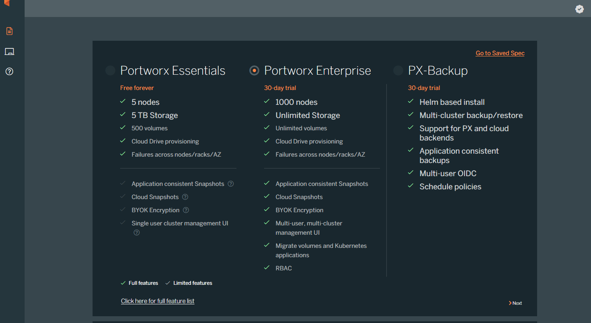
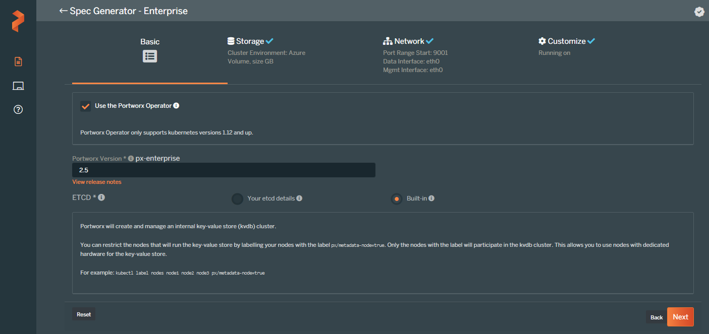
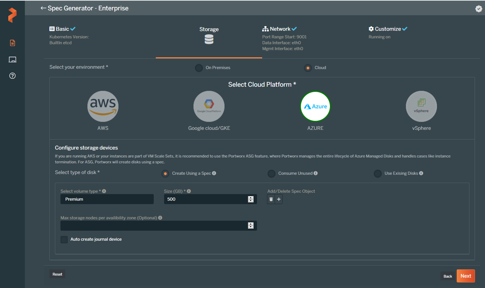
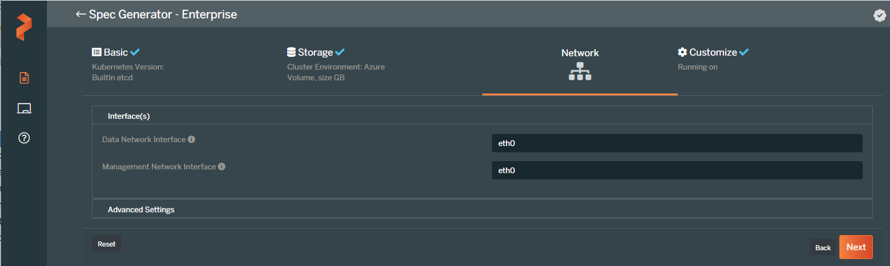
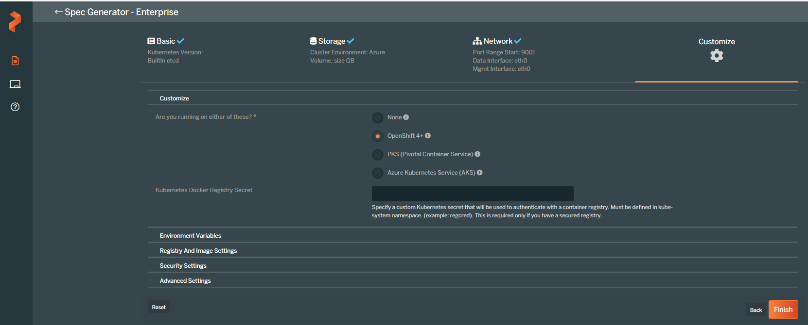
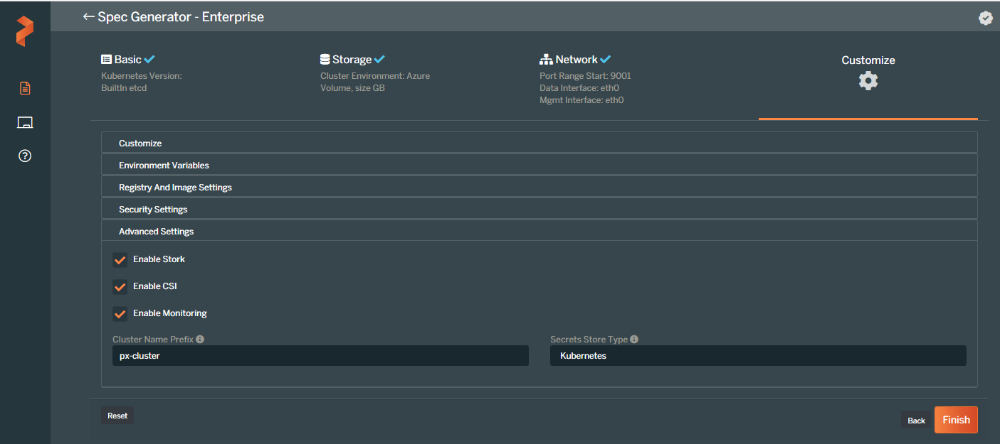
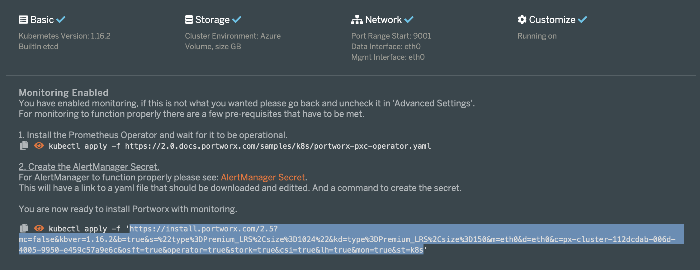

### Generating the Portworx Spec URL
* Launch the [spec generator](https://central.portworx.com/specGen/wizard)
* Select `Portworx Essentials` or `Portworx Enterprise` and press Next:

* Check `Use the Portworx Operator` box, select the `Portworx version` as `2.5`, select `Built-in` and then press Next:

* Select `Cloud` as your environment. Click on `Azure` and select `Create Using a Spec` option for `Select type of disk`.
Enter value for `Size(GB)` as `500` and then press Next.

* Enter `eth0` for the network interfaces and press Next:

* Select `Openshift 4+` as Openshift version, go to Advanced Settings:

* In the Advanced Settings tab select `CSI` and `Monitoring` and press Finish

* Copy the Spec URL:


### Portworx encryption: 

* To enable encryption in the portworx storage cluster, follow the below steps. 
* While generating the portworx spec file , In the Advanced Settings tab select select the `Secret Store type` as `Kubernetes`. 

* Use this spec file for setting up portworx. 
* To enable encryption please update the variables `porworx-encryption` with value `yes` and  `portworx-encryption-key` with the desired key value.
* Also the required storage classes are created with `secure` flag as `true`. 
* After the terraform scrips is completed the portworx encryption can be verified as below. 

* In your Storage Class manifest file, specify `secure: "true"` under the parameters:


```bash 
   #!/bin/bash

   oc apply -f - << EOF
   kind: StorageClass
   apiVersion: storage.k8s.io/v1
   metadata:
     name: px-secure-sc
   provisioner: kubernetes.io/portworx-volume
   parameters:
     secure: "true"
     repl: "3"
   EOF
  ``` 

* Then you can create a PVC using the above secure storage class to provision an encrypted PVC:


```bash 

  #!/bin/bash

  oc apply -f - << EOF
  kind: PersistentVolumeClaim
  apiVersion: v1
  metadata:
    name: secure-pvc
  spec:
    storageClassName: px-secure-sc
    accessModes:
    - ReadWriteOnce
    resources:
      requests:
        storage: 3Gi
  EOF

```

* Use the following commands to very that encrypted volume has been provisioned, i.e.

```bash 

# PX_POD=$(kubectl get pods -l name=portworx -n kube-system -o jsonpath='{.items[0].metadata.name}')
# oc exec $PX_POD -n kube-system -- /opt/pwx/bin/pxctl volume list
ID                      NAME                                            SIZE    HA      SHARED  ENCRYPTED       PROXY-VOLUME    IO_PRIORITY       STATUS          SNAP-ENABLED
476044494696915802      pvc-28e9e9f5-2915-455f-8c2f-d76dfa47fa82        3 GiB   3       no      yes             no              HIGH            up-    detached   no
[root@sre-3m15w-upgrade-tier-01-inf encrypted]#

```
