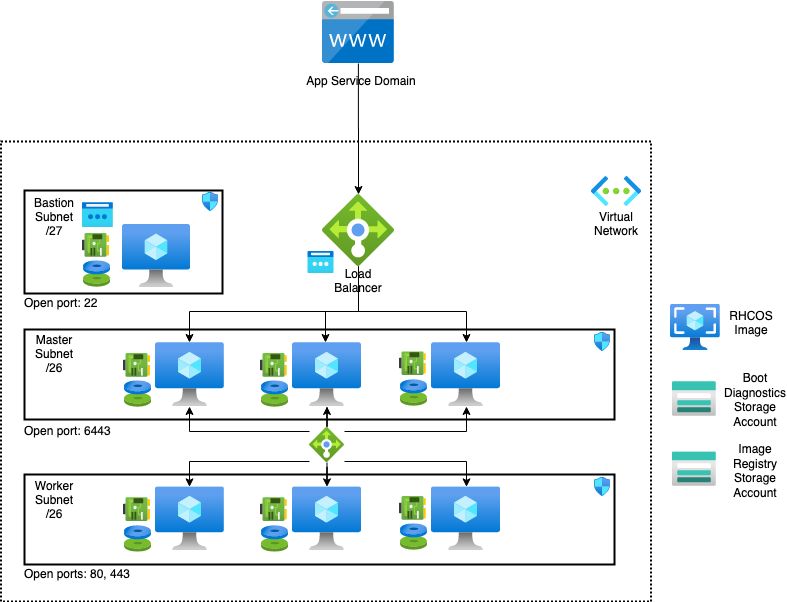

# Cloud Pak for Data 3.5 on OCP 4.5 on Azure

## Deployment Topology

Deploying this template builds the following Cloud Pak for Data cluster in single zone or multi zone.



The template sets up the following:
- A highly available architecture that spans up to three Availability Zones.
- A Virtual network configured with public and private subnets.
-  In a public subnet, a bastion host to allow inbound Secure Shell (SSH) access to compute instances in private subnets.
-	In the private subnets:
    * OpenShift Container Platform master instances.
    * OpenShift compute nodes with machine auto scaling features.
- An Azure Load Balancer spanning the public subnets for accessing Cloud Pak for Data from a web browser.
- Storage disks with Azure Managed Disk mounted on compute nodes for Portworx or OCS (OpenShift Container Storage) v4.5 or on an exclusive node for NFS.
- An Azure domain as your public Domain Name System (DNS) zone for resolving domain names of the IBM Cloud Pak for Data management console and applications deployed on the cluster.

### Requirements

* Install [az-cli](https://docs.microsoft.com/en-us/cli/azure/install-azure-cli?view=azure-cli-latest).
* Install [terraform](https://learn.hashicorp.com/terraform/getting-started/install.html).


### Steps to Deploy

* Create an [App Service Domain](https://portal.azure.com/#create/Microsoft.Domain).
  * This will also create a DNS Zone needed for this deployment.
  * Note the DNS Zone name.
* Create an Azure Service Principal with `Contributor` and `User Access Administrator` roles.
  * Create a Service Principal, using your Azure Subscription ID, named with a valid URL (e.g. http://john.doe.SP) and save the returned json:
    ```bash
    az login
    az ad sp create-for-rbac --role="Contributor" --name="<URL>" --scopes="/subscriptions/<subscription_id>"
    ```
  * Get an `Object ID`, using the AppId from the Service Principal just created:
    ```bash
    az ad sp list --filter "appId eq '<app_id>'"
    ```
  * Assign the `User Access Administrator` role, using the `Object Id`:
    ```bash
    az role assignment create --role "User Access Administrator" --assignee-object-id "<object_id>"
    ```
* [Download](https://cloud.redhat.com/openshift/install/pull-secret) a pull secret. Create a Red Hat account if you do not have one.

* [Sign up](https://www.ibm.com/account/reg/us-en/signup?formid=urx-42212) for a Cloud Pak for Data Trial Key if you don't have the entitlement API key.

* If you choose Portworx as your storage class, see [Portworx documentation](PORTWORX.md) for generating `portworx spec url`. 

* Read and agree to the [license terms](https://ibm.biz/Bdq6KP).

* Change to `azure_infra` folder:

* Check that the roles are correctly assigned by executing the script `./validate_azure_subscription.sh`.
* `[Optional]` If you choose to use the external registry for CPD installation with pre-loaded CPD images, please set the variables `cpd-external-registry`, `cpd-external-username` and the corresponding `apikey`. See the [Variables documentation](VARIABLES.md) for more details. If these values are not provided, by default the installation takes the images from the cp.icr.io/cp/cpd repo. In this case please ensure to provide the entitlement API key for variable `apikey`.
* Enter configuration variables in `variables.tf` file. See the [Variables documentation](VARIABLES.md) for more details:
* Deploy:
  ```bash
  terraform init
  terraform apply
  ```
### Deploying to an existing network
* The existing network and the new cluster must be deployed to the same region.
* The existing network must have separate subnets for the master, bootnode, worker, and if nfs storage is chosen, nfs subnet.

### Destroying the cluster

* Run:
  ```bash
  terraform destroy
  ```

