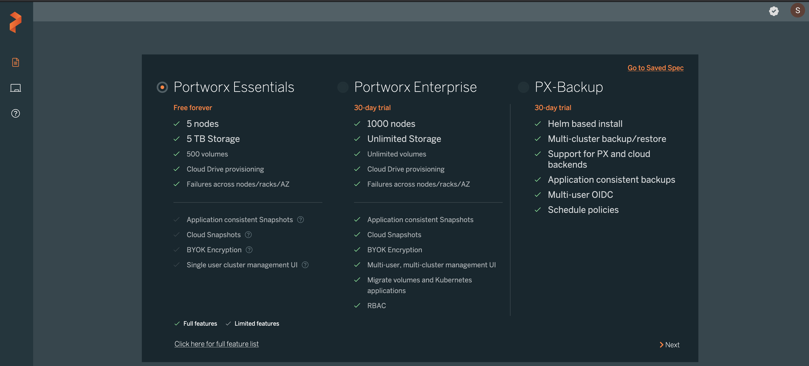
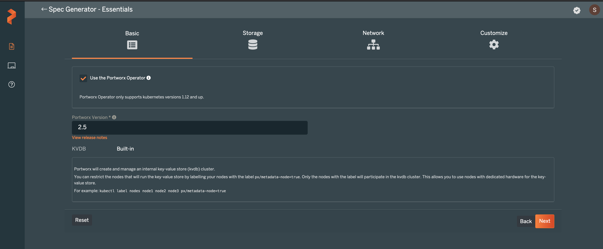
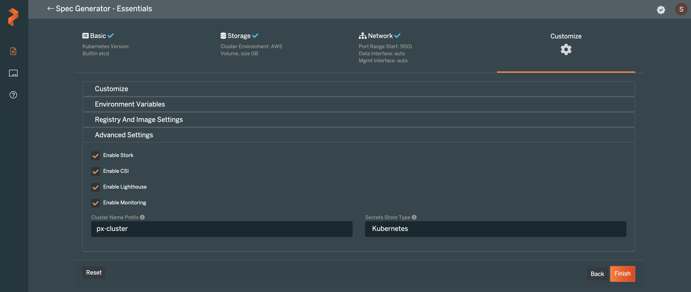

### Generating the Portworx Spec URL
* Launch the [spec generator](https://central.portworx.com/specGen/wizard)
* Select `Portworx Essentials` or `Portworx Enterprise` and press Next to continue:

* Check `Use the Portworx Operator` box and select the `Portworx version` as `2.5` For `ETCD` select `Built-in` option and then press Next:

* Select `Cloud` for `Select your environment` option. Click on `AWS` and select `Create Using a Spec` option for `Select type of disk`.
Enter value for `Size(GB)` as `1000` and then press Next. 

* Leave `auto` as the network interfaces and press Next:

* Select Openshift 4+ as Openshift version, go to `Advanced Settings`:

* In the `Advanced Settings` tab select CSI and Monitoring and press Finish:

* Copy Spec URL:

