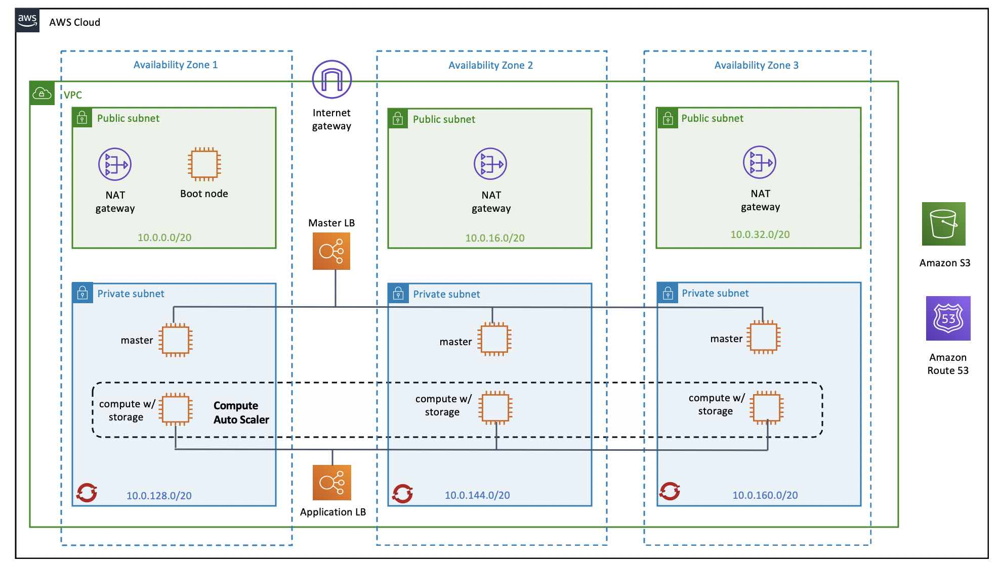
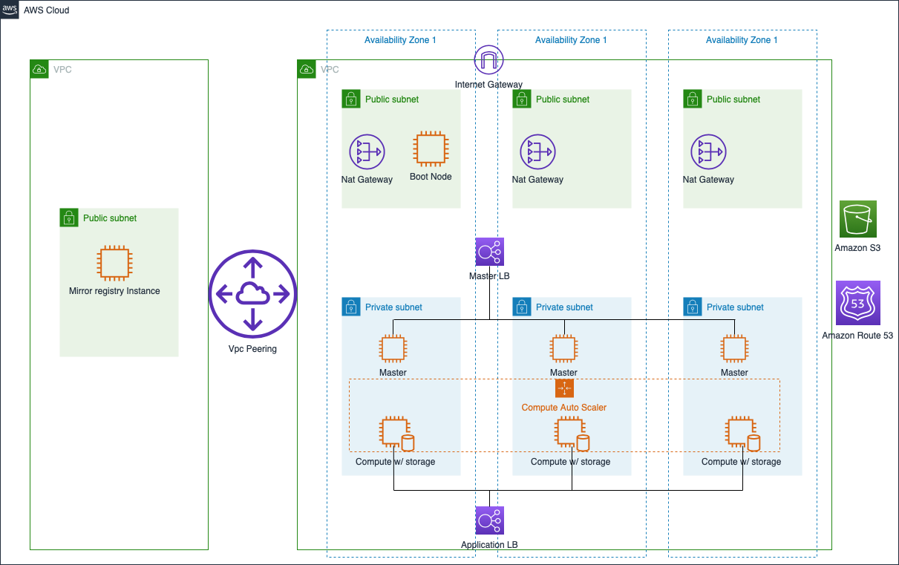

# Cloud Pak for Data 3.5 on OCP 4.6 on AWS (User Provisioned Infrastructure)

## Deployment Topology

Deploying this template builds the following Cloud Pak for Data cluster in single zone or multi zone.

#### CPD Installation using User Provisioned Infrastructure


#### CPD Installation using a Mirror Registry


The deployment sets up the following as shown in the diagram.
 - A highly available architecture that spans one or three Availability Zones.
 - A VPC configured with public and private subnets according to AWS best practices, to provide you with your own virtual network on AWS.
 - In the public subnets:
   - Managed network address translation (NAT) gateways to allow outbound internet access for resources in the private subnets.
   - A bootstrap server Amazon Elastic Compute Cloud (Amazon EC2) instance that also serves as a bastion host to allow inbound Secure Shell (SSH) access to EC2 instances in private subnets.
 - In the private subnets:
   - OCP master instances up to three Availability Zones
   - OpenShift Container Platform (OCP) compute nodes.
   - Elastic Block Storage disks that are mounted on the compute nodes for container persistent data.
 - A Classic Load Balancer spanning the public subnets for accessing Cloud Pak for Data from a web browser. Internet traffic to this load balancer is only permitted from ContainerAccessCIDR.
 - A Network Load Balancer spanning the public subnets for accessing the OCP master instances. Internet traffic to this load balancer is only permitted from RemoteAccessCIDR.
 - A Network Load Balancer spanning the private subnets for routing internal OpenShift application programming interface (API) traffic to the OCP master instances.
 - Amazon Route 53 as your public Domain Name System (DNS) for resolving domain names of the IBM Cloud Pak for Data management console and applications deployed on the cluster.
 - A VPC Peering connectionn between two VPCs if installing the cluster using a Mirror Registry.

### Steps to Deploy (CPD Installation using User Provisioned Infrastructure)

1. Create a Route 53 domain.
2. [Download](https://cloud.redhat.com/openshift/install/pull-secret) a pull secret. Create a Red Hat account if you do not have one.
3. [Sign up](https://www.ibm.com/account/reg/us-en/signup?formid=urx-42212) for a Cloud Pak for Data Trial Key if you don't have the entitlement API key.
4. If you choose Portworx as your storage class, see [Portworx documentation](PORTWORX.md) for generating `portworx spec url`.
5. Edit `variables.tf` and provide values for all the configuration variables. See the [Variables documentation](VARIABLES.md) for more details.
6. Read the license at https://ibm.biz/BdqyB2 and accept it by setting variable `accept-cpd-license` to `accept`.
7. If you want to hide sensitive data such as access_key_id or secret_access_key, remove the `default     = " " ` from `variables.tf` file against that variable.
```
Example:

variable "access_key_id" {
}
```
8. Create file `osaws_var.tfvars` and write all the sensitive variables for which no `default     = " " ` value is provided in `variables.tf` file.
```
Example:

cat osaws_var.tfvars

access_key_id = "xxxxxxxxxxxxxxxxxxxxxxx"
secret_access_key = "xxxxxxxxxxxxxxxxxxxxxxx"
```
9. Change the current directory to aws_infra:
```
cd cp4d-deployment-master/UPI/aws/aws_infra
```
10. Deploy scripts by executing the following command from the `cp4d-deployment-master/UPI/aws/aws_infra` directory:
```bash
terraform init
terraform apply -var-file="Path To osaws_var.tfvars file"
```

### Steps to Deploy (CPD Installation using a Mirror Registry)

1. Create a Mirror Registry, follow the steps here [Mirror Registry Creation](../mirror-registry) .
2. Follow the steps 1 to 9 from "CPD Installation using User Provisioned Infrastructure" above.
3. Copy `/opt/registry/certs/domain.crt` file from the RHEL server where Mirror Registry is created to the current installer machine.
4. Update the `pull-Secret` file's value to contain the authentication information for your mirror registry. 
```
pullSecret: '{"auths":{"<local_registry>:<port>": {"auth": "<credentials>","email": "you@example.com"}}}'
```
* For `<local_registry>:<port>`, specify the `registry domain name` and the `port` that your mirror registry uses to serve content. 
* You can get the value of `local_registry` and `port` from the `imageContentSources` section generated during creation of Mirror Registry.
```
Example:
ip-10-5-13-111.eu-north-1.compute.internal:5000
```
* For `<credentials>`, specify the `base64-encoded` `username` and `password` that you provided for creating the mirror registry.
 ```
 Example: (execute it in a Linux machine)
 echo -n '<user_name>:<password>' | base64 -w0 
 
 BGVtbYk3ZHAtqXs=
 ```
 5. If you selected `OCS` as the storage type, follow below steps to setup `OCS` in a disconnected environment.
   * Copy `ocs-disconnected.sh` [script](../mirror-registry) to the `Mirror Registry ec2 machine` where other mirror registry 
   scripts are present.
   * Make sure `pull-secret.json` generated during mirror registry setup is present in that directory.
   * Change the script mode to executable, `chmod +x ocs-disconnected.sh`.
   * Execute the script as `./ocs-disconnected.sh MIRROR_REGISTRY_DNS` where `MIRROR_REGISTRY_DNS` is `<local_registry>:<port>` value from the `imageContentSources` section, from the output of the command for creating mirror registry. 
   Example ip-0-0-0-0.eu-west-3.compute.internal:5000
   * This script will build and mirror the catalog for redhat-operators. This is a long operation and will take more then 5 hours.
   * Once the build and mirroring is complete, `redhat-operators-manifests/imageContentSourcePolicy.yaml` file gets created. Copy this file to your local
   system. You have to input it's local path as an input to `imageContentSourcePolicy-path` variable in `variables.tf` file while
   creating the cluster.
 6. Deploy scripts by executing the following command from the `cp4d-deployment-master/UPI/aws/aws_infra` directory:
```bash
terraform init
terraform apply -var-file="Path To osaws_var.tfvars file"
```
 7. Once installation is completed copy `$HOME/auth/kubeconfig` file from  cluster to the Mirror ec2 instance. To access the
 cluster execute `export KUBECONFIG="path on mirror machine to\kubeconfig"` on mirror ec2 instance. 
#### Note:
If for some reason your installation failed and you trying to run terraform apply again after destroying the remaining resources, make sure to edit the route of Mirror registry instance that you provided in variables.tf file `variable "mirror-routetable-id"`and remove the vpc peering connection in the status `blackhole` before starting the next run. Example [here](images/vpc-peering.png) remove the entry for route containing the vpc peering (pcx-xxxx) detail in the status `blackhole`.
### Destroying the cluster
Execute:
  ```bash
  terraform destroy -var-file="Path To osaws_var.tfvars file"
  aws cloudformation delete-stack --stack-name vpc-stack
  ``` 
* It will take around five minutes to destroy vpc stack. You can check the status using `aws cloudformation describe-stacks --stack-name vpc-stack` or from your aws console's `CloudFormation` service.

### Note:
Elastic File System is a Technology Preview feature only. Technology Preview features are not supported with Red Hat production service level agreements (SLAs) and might not be functionally complete. Red Hat does not recommend using them in production. These features provide early access to upcoming product features, enabling customers to test functionality and provide feedback during the development process.
see [Elastic File System](https://docs.openshift.com/container-platform/4.3/storage/persistent_storage/persistent-storage-efs.html).
[Red Hat Technology Preview Features](https://access.redhat.com/support/offerings/techpreview/)
