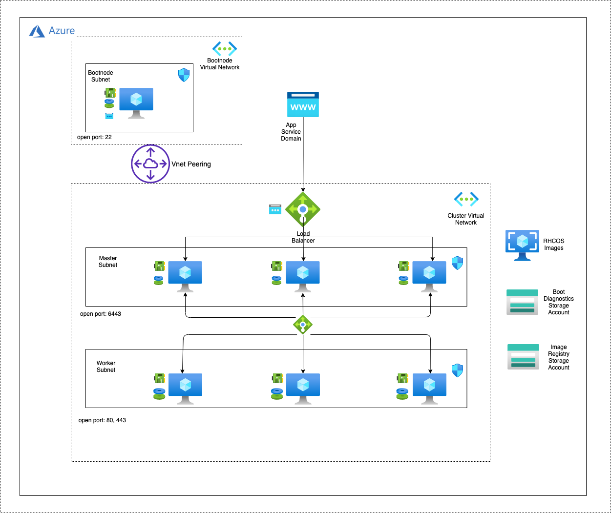

# Cloud Pak for Data 3.5 on OCP 4.6 on Azure (User Provisioned Infrastructure)

## Deployment Topology

Deploying this template builds the following Cloud Pak for Data cluster in single zone or multi zone.

#### CPD Installation using User Provisioned Infrastructure 



#### CPD Installation using Mirror Registry 


The template sets up the following:

* A highly available architecture that spans up to three Availability Zones.
* A Virtual network configured with public and private subnets.
*  In a public subnet, a bastion host to allow inbound Secure Shell (SSH) access to compute instances in private subnets.

-	In the private subnets:

    - OpenShift Container Platform master instances.
    - OpenShift compute nodes with machine auto-scaling features.
* An Azure Load Balancer spanning the public subnets for accessing Cloud Pak for Data from a web browser.
<!-- * Storage disks with Azure Managed Disk mounted on compute nodes for Portworx or on an exclusive node for NFS. -->
* Storage disks with Azure Managed Disk mounted on an exclusive node for NFS.
* An Azure domain as your public Domain Name System (DNS) zone for resolving domain names of the IBM Cloud Pak for Data management console and applications deployed on the cluster.

### Requirements

* Install [az-cli](https://docs.microsoft.com/en-us/cli/azure/install-azure-cli?view=azure-cli-latest).
* Install [terraform](https://learn.hashicorp.com/terraform/getting-started/install.html).

### Note: 

* This terraform script supports CPD 3.5 with OCP 4.6.13 version and storage type is NFS(currently). (Portworx will be supported in the next refresh) 

### Steps to create Azure Service Principal

1. Create an [App Service Domain](https://portal.azure.com/#create/Microsoft.Domain).
  + This will also create a DNS Zone needed for this deployment.
  + Note the DNS Zone name.
2. Create an Azure Service Principal with `Contributor` and `User Access Administrator` roles.
  + Create a Service Principal, using your Azure Subscription ID, named with a valid URL (e.g. http://john.doe.SP) and save the returned JSON:

    

    ``` bash
    az login
    az ad sp create-for-rbac --role="Contributor" --name="<URL>" --scopes="/subscriptions/<subscription_id>"
    ```

  + Get an `Object ID`, using the AppId from the Service Principal just created:

    

    ``` bash
    az ad sp list --filter "appId eq '<app_id>'"
    ```

  + Assign the `User Access Administrator` role, using the `Object Id`:

    

    ``` bash
    az role assignment create --role "User Access Administrator" --assignee-object-id "<object_id>"
    ```

  + Assign the `Azure Active Directory Graph` permission, run the following command:

    

    ``` bash
    az ad app permission add --id <appId> \ 
     --api 00000002-0000-0000-c000-000000000000 \
     --api-permissions 824c81eb-e3f8-4ee6-8f6d-de7f50d565b7=Role
    ```

    Replace appID with the AppId parameter value from your service principal.

  + Approve the permission request: 

  ```bash 
   az ad app permission grant --id <appId> \ 

     --api 00000002-0000-0000-c000-000000000000
  ``` 
    Replace appID with the AppId parameter value from your service principal.
### Steps to Deploy (CPD Installation using User Provisioned Infrastructure)

Follow the below steps for installation using User Provisioned Infrastructure. 

1. [Download](https://cloud.redhat.com/openshift/install/pull-secret) a pull secret. Create a Red Hat account if you do not have one.

2. [Sign up](https://www.ibm.com/account/reg/us-en/signup?formid=urx-42212) for a Cloud Pak for Data Trial Key if you don't have the entitlement API key.

<!-- * If you choose Portworx as your storage class, see [Portworx documentation](PORTWORX.md) for generating `portworx spec url`.  -->

* Read and agree to the [license terms](https://ibm.biz/Bdq6KP).
* The ARM templates can be found [here](https://github.ibm.com/IIG/cpd_terraform/tree/master/UPI/azure/openshift_module) which can be customized as per the requirement.
* Change to `azure_infra` folder:
* Enter configuration variables in `variables.tf` file. See the [Variables documentation](VARIABLES.md) for more details:
* Deploy:

  ```bash
  terraform init
  terraform apply
  ```

### Steps to Deploy (CPD Installation using a Mirror Registry)

Follow the below steps for installation using Mirror-registry. 

1. Create a Mirror Registry, follow the steps here [Mirror Registry Creation](./MirrorRegistrySetupForAzure.md).
2. [Download](https://cloud.redhat.com/openshift/install/pull-secret) a pull secret. Create a Red Hat account if you do not have one. 
3. Convert the pull-secret file to JSON format by following the below steps. 

    ```bash 
    Make a copy of your pull secret in JSON format:
    
      cat ./pull-secret | jq .  > ./pull-secret-dup.json

    Add your credentials to  pull-secret.json

      cat pull-secret-dup.json | jq '.auths |= . +  {"HOSTPORT": { "auth": "TOKEN", "email": "you@example.com"}}' pull-secret-dup.json > pull-secret.json

      sed -i "s/TOKEN/$TOKEN/g" pull-secret.json
    
    Convert the credentials to base64 format. 
    
      TOKEN=echo -n <mirror_reg_username>:<mirror_reg_password>  | base64 -w0

      sed -i "s/HOSTPORT/<mirror_reg_hostname:5000>/g" pull-secret.json

      sed -i "s/you@example.com/<email_id_used_for_creating_certs>/g" pull-secret.json

4. The above step will create the pull-secret.json file required for the disconnected install. This file can be taken from the mirror-registry node setup as well. This file will be created as part of the createMirrorRegistry.sh script execution.

5. Copy the domain.crt file from the mirror_registry node to your terraform execution machine. This file path needs to be specified during the execution. 

6. Input all the required values in the variables.tf or create a tfvars files with the required values. Please refer [variables.md](./VARIABLES.md) file for more details. 

7. Deploy scripts by executing the following command from the `cp4d-deployment-master/UPI/azure/azure_infra` directory:

    ``` bash
       terraform init
       terraform apply
    ```
### Destroying the cluster

* Run:

  

``` bash
  terraform destroy
  ```
## Reference 

The User Provisioned Infrastructure documentation from Redhat can be found here. 

https://docs.openshift.com/container-platform/4.6/installing/installing_azure/installing-azure-user-infra.html 